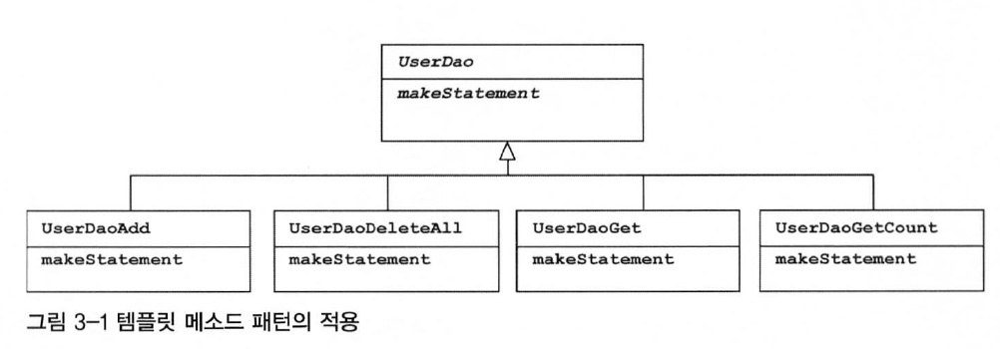
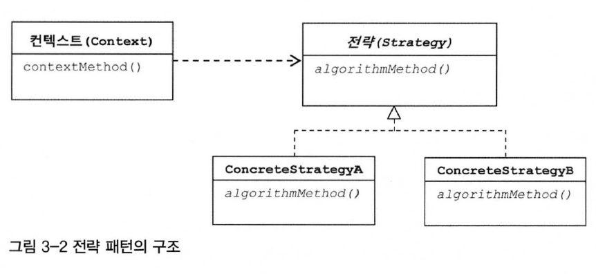
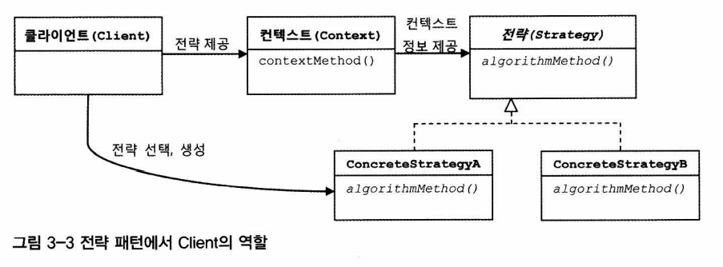

`변화의 특성이 다른 부분을 구분`해주고, `각각 다른 목적과 다른 이유에 의해 다른 시점에 독립적으로 변경될 수 있는 효율적인 구조`를 만들어주는 것이 바로 이 **개방 폐쇄 원칙**이다.

**템플릿**이란  
이렇게 바뀌는 성질이 다른 코드 중에서 변경이 거의 일어나지 않으며 `일정한 패턴으로 유지되는 특성을 가진 부분`을 `자유롭게 변경되는 설징을 가진 부분`으로 **독립**시켜서 효과적으로 활용할 수 있도록 하는 방법이다.


# **3.1 다시 보는 초난감 DAO**

`UserDao`의 **예외처리를 개선하자**

## 3.1.1 예외처리 기능을 갖춘 DAO

### JDBC 예외처리

`Connection`과 `PreparedStatement`라는 두 개의 공유 리소스를 가져와 사용한다.  
`close()`를 호출하기 전에 예외가 나버리면 **반환**이 되지 않는다.  
- 예전 토이 프로젝트를 개발할 때 JDBC를 사용하면서 `finally`에서 반환하는 부분을 빼먹은 적이 있었는데,
- 서버에 요청은 제대로 가는데 DB가 계속 멈춰있었던 기억이 았다.
- `Connection`과 `Statement`는 **풀(pool)**방식으로 운영되기 때문에 자원을 잘 반납해야 고갈되지 않는다.

```java
public int getCount() throws SQLException {
    Connection con = null;
    PreparedStatement ps = null;
    ResultSet rs = null;
    try{
        con = dataSource.getConnection();
        ps = con.prepareStatement("select count(*) from users");

        rs = ps.executeQuery();
        rs.next();
        return rs.getInt(1);
    } catch (SQLException e) {
        throw e;
    } finally {
        if(rs != null){
            try{
                rs.close();
            } catch (SQLException e){}
            try{
                ps.close();
            } catch (SQLException e){}
            try{
                con.close();
            } catch (SQLException e){}
        }
    }
}
```

# **3.2 변하는 것과 변하지 않는 것**

## 3.2.1 JDBC `try/catch/finally` 코드의 문제점

컴파일 에러가 나지않고 `try/catch/finally`를 잘 못 작성하게 된다면 큰일이다.  
이렇게 각 메소드마다 반복되는 자원 반납 코드의 핵심은 **변하지 않는, 그러나 많은 곳에서 중복되는 코드와 로직에 따라 자꾸 확장되고 자주 변하는 코드를 분리해내는 작업**이다.  

## 3.2.2 분리와 재사용을 위한 디자인 패턴 적용

### 템플릿 메소드 패턴의 적용

**템플릿 메소드 패턴**은 상속을 통해 기능을 확장해서 사용하는 부분이다.  
`변하지 않는 부분은 슈퍼클래스`에 두고 `변하는 부분은 추상 메소드로 정의`해둬서 **서브클래스에서 오버라이드 하여 새롭게 정의해 쓰도록 하는 것**이다.

```java

abstract protected PreparedStatement makeStatement(Connection c) throws SQLException;

***

public class UserDaoDeleteAll extends UserDao {
    protected PreparedStatement makeStatement(Connection c) throws SQLException {
        PreparedStatement ps = c.prepareStatement("delete from users");
        return ps;
    }
}
```

상속을 통해 자유롭게 확장할 수 있고, 확장 때문에 기존의 상위 DAO클래스에 불필요한 변화는 생기지 않도록 할 수 있다.  
개방 폐쇄 원칙을 그럭저럭 지키는 구조를 만들어 낸 것 같다.  
하지만 **템플릿 메소드 패턴**으로의 접근은 제한이 많다.  
1. **DAO로직마다 상속을 통해 새로운 클래스를 만들어야 한다는 점**
2. **확장구조가 이미 클래스를 설계하는 시점에서 고정되어 버린다는 점**
   - 클래스 레벨에서 컴파일 시점에 관계가 결정되어 버린다.
   - 유연성이 떨어진다.




### 전략 패턴의 적용 [예제](https://github.com/jdalma/tobyspringin5/commit/6d06d0a9542b8e594d5c5f4b3f56707aebfa013a)

오브젝트를 아예 둘로 분리하고 클래스 레벨에서는 `인터페이스를 통해서만 의존`하도록 만드는 **전략 패턴**이다.
`확장에 해당하는 변하는 부분을 클래스`로 만들어 **추상화된 인터페이스를 통해 위임하는 방식**이다.  



- 변하지 않는 부분이 `contextMethod()` , DB를 업데이트 하는 작업이라는 변하지 않는 **맥락**을 갖는다.
- `PreparedStatement`를 만들어주는 외부 기능이 바로 **전략 패턴**에서 말하는 **전략**이라고 볼 수 있다.

하지만 이렇게 컨텍스트 안에서 이미 구체적인 전략 클래스인 `DeleteAllStatement`를 사용하도록 고정되어 있는건 이상하다.  
DB를 업데이트 하는 작업이라는 변하지 않는 **맥락**에서 특정 구현 클래스인 `DeleteAllStatement`를 직접 알고 있다는 건, **전략 패턴에도 OCP에도 잘 들어맞는다고 볼 수 없기 때문**이다.

### DI 적용을 위한 전략 패턴의 클라이언트/컨텍스트 분리 [예제](https://github.com/jdalma/tobyspringin5/commit/9ea3e3e137b543137d51c0224cb5a1fcb3f878fc) ⭐️

위의 문제를 해결하기 위해 전략 패턴의 실제적인 사용 방법을 좀 더 살펴보자.  
전략 패턴에 따르면 `Context`가 어떤 전략을 사용하게 할 것인가는 `Context`를 사용하는 앞단의 **Client가 결정하는게 일반적**이다.    



> 1장에서 사용한 방법이다.
> 컨텍스트가 필요로 하는 전략의 "특정 구현 클래스 오브젝트를 클라이언트가 만들어서 제공해주는 방법"을 사용했다.

- **DI란** 이러한 전략 패턴의 장점을 일반적으로 활용할 수 있도록 만든 구조라고 볼 수 있다.

일단! 컨텍스트에 해당하는 부분은 별도의 메소드로 독립 시키고 클라이언트는 전략 클래스의 오브젝트를 메소드로 전달하자  
- `deleteAll()` → **클라이언트** , 전략 오브젝트를 만들고 컨텍스트를 호출하는 책임을 가지고 있다.
- `new DeleteAllStatement()` → **전략의 특정 구현 클래스 오브젝트** 
- `jdbcContextWithStatementStrategy(StatementStrategy stmt)` → **컨텍스트**

<br>

**마이크로 DI**  
가장 중요한 개념은 **제3자의 도움을 통해 두 오브젝트 사이의 유연한 관계가 설정되도록 만든다는 것이다.**  
일반적으로 DI는 **4개의 오브젝트 사이에서 일어난다.**  
1. 의존관계에 있는 두 개의 오브젝트
2. 이 관계를 다이나믹하게 설정해주는 오브젝트 팩토리 (DI 컨테이너)
3. 이를 사용하는 클라이언트  

클라이언트와 DI 관계예 있는 두 개의 오브젝트가 모두 하나의 클래스안에 담길 수도 있다.  
이런 경우에는 DI가 매우 작은 단위의 코드와 메소드 사이에서 일어나기도 한다.  
`DI의 장점을 단순화 해서 IoC 컨테이너의 도움 없이 코드 내에서 적용한 경우`를 **마이크로 DI (수동 DI)**라고 한다.  

# **3.3 JDBC 전략 패턴의 최적화**

## 3.3.1 전략 클래스의 추가 `add()` [예제](https://github.com/jdalma/tobyspringin5/commit/8d156bd4d0c151ac91b564deec32fd2485dd6369)

이번엔 `add()`메소드에도 적용해보자  

## 3.3.2 전략과 클라이언트의 동거

위의 전략 패턴에는 
1. DAO 메소드마다 새로운 `StatementStrategy` 구현 클래스를 만들어야 한다는 점
2. `StatementStrategy`에 전달한 엔티티의 부가적인 정보를 매번 넘겨줘야 하는 점

같은 불편함이 있다.  

### 새로운 구현 클래스를 매번 만드는 불편함을 내부 클래스로 해결

`StatementStrategy` 전략 클래스를 매번 독립된 파일로 만들지 말고 클래스의 필드를 선언하듯이 `UserDao`안에 내부 클래스로 정의해버리면 해결된다.

```java
public void add(final User user) throws SQLException{
     class AddStatement implements StatementStrategy {
         @Override
         public PreparedStatement makePreparedStatement(Connection c) throws SQLException {
             PreparedStatement ps = c.prepareStatement("insert into users(id , name , password) values(?, ?, ?)");

             // 로컬(내부) 클래스의 코드에서 외부의 메소드 로컬 변수에 직접 접근할 수 있다.
             ps.setString(1 , user.getId());
             ps.setString(2 , user.getName());
             ps.setString(3 , user.getPassword());

             return ps;
         }
     }
     // 생성자 파라미터로 User를 전달하지 않아도 된다.
     jdbcContextWithStatementStrategy(new AddStatement());
 }
```

**장점**  
1. 클래스 파일을 줄일 수 있다.
2. 내부 클래스의 특징을 이용해 로컬 변수를 바로 가져다 사용할 수 있다.

### 익명 내부 클래스로 내부 클래스의 이름 마저 삭제

익명 내부 클래스는 **선언과 동시에 오브젝트를 생성한다.**  
이름이 없기 때문에 클래스 자신의 타입을 가질 수 없다.  

```java
 public void add(final User user) throws SQLException{
     StatementStrategy st = new StatementStrategy() {
         @Override
         public PreparedStatement makePreparedStatement(Connection c) throws SQLException {
             PreparedStatement ps = c.prepareStatement("insert into users(id , name , password) values(?, ?, ?)");

             ps.setString(1, user.getId());
             ps.setString(2, user.getName());
             ps.setString(3, user.getPassword());

             return ps;
         }
     };
     jdbcContextWithStatementStrategy(st);
 }
 
 // 람다로 변경
public void add(final User user) throws SQLException{
     StatementStrategy st = c -> {
        PreparedStatement ps = c.prepareStatement("insert into users(id , name , password) values(?, ?, ?)");

        ps.setString(1, user.getId());
        ps.setString(2, user.getName());
        ps.setString(3, user.getPassword());

        return ps;
     };
     jdbcContextWithStatementStrategy(st);
}
```

# **3.4 컨텍스트와 DI** 

## 3.4.1 JdbcContext의 분리
