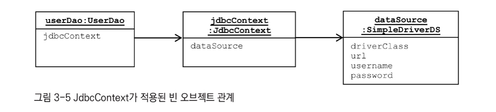

`변화의 특성이 다른 부분을 구분`해주고, `각각 다른 목적과 다른 이유에 의해 다른 시점에 독립적으로 변경될 수 있는 효율적인 구조`를 만들어주는 것이 바로 이 **개방 폐쇄 원칙**이다.

**템플릿**이란  
이렇게 바뀌는 성질이 다른 코드 중에서 변경이 거의 일어나지 않으며 `일정한 패턴으로 유지되는 특성을 가진 부분`을 `자유롭게 변경되는 설징을 가진 부분`으로 **독립**시켜서 효과적으로 활용할 수 있도록 하는 방법이다.

```
"변하는 것과 변하지 않는 것을 분리하고 변하지 않는 건 유연하게 재활용 할 수 있게 만든다"는 간단한 원리를 계속 적용했을 때 이렇게 단순하면서도 안전하게 작성 가능한 JDBC 활용 코드가 완성된다.
바로 이런게 객체 지향 언어와 설계를 사용하는 매력이 아닐까?

스프링을 사용하는 개발자라면 당연히 스프링이 제공하는 템플릿/콜백 기능을 잘 사용할 수 있어야 한다.
원리도 알지 못한 채로 기계적으로 사용하는 경우와 적용된 패턴을 이해하고 사용하는 경우는 큰 차이가 있다.
기본적으로 OCP를 지키고, 전략 패턴과 DI를 바탕에 깔고 있으니 원한다면 언제든지 확장해서 편리한 방법으로 사용할 수 있다.

고정된 작업 흐름을 갖고 있으면서 여기저기서 자주 반복되는 코드가 있다면, 중복되는 코드를 분리할 방법을 생각해보는 습관을 기르자.
템플릿과 콜백을 찾아낼 때는, 변하는 코드의 경계를 찾고 그 경계를 사이에 두고 주고받는 일정한 정보가 있는지 확인하면 된다.
코드의 특성이 바뀌는 경계를 잘 살피고 그것을 인터페이스를 사용해 분리한다는, 가장 기본적인 객체지향 원칙에만 충실하면 어렵지 않게 템플릿/콜백 패턴을 만들어 활용할 수 있을 것이다.

Spring의 클래스 이름이 "Template"으로 끝나거나 인터페이스 이름이 "Callback"으로 끝난다면 템플릿/콜백이 적용된 것이라고 보면 된다.
```

# **3.1 다시 보는 초난감 DAO**

`UserDao`의 **예외처리를 개선하자**

## 3.1.1 예외처리 기능을 갖춘 DAO

### JDBC 예외처리

`Connection`과 `PreparedStatement`라는 두 개의 공유 리소스를 가져와 사용한다.  
`close()`를 호출하기 전에 예외가 나버리면 **반환**이 되지 않는다.  
- 예전 토이 프로젝트를 개발할 때 JDBC를 사용하면서 `finally`에서 반환하는 부분을 빼먹은 적이 있었는데,
- 서버에 요청은 제대로 가는데 DB가 계속 멈춰있었던 기억이 았다.
- `Connection`과 `Statement`는 **풀(pool)** 방식으로 운영되기 때문에 자원을 잘 반납해야 고갈되지 않는다.

```java
public int getCount() throws SQLException {
    Connection con = null;
    PreparedStatement ps = null;
    ResultSet rs = null;
    try{
        con = dataSource.getConnection();
        ps = con.prepareStatement("select count(*) from users");

        rs = ps.executeQuery();
        rs.next();
        return rs.getInt(1);
    } catch (SQLException e) {
        throw e;
    } finally {
        if(rs != null){
            try{
                rs.close();
            } catch (SQLException e){}
            try{
                ps.close();
            } catch (SQLException e){}
            try{
                con.close();
            } catch (SQLException e){}
        }
    }
}
```

***

# **3.2 변하는 것과 변하지 않는 것**

## 3.2.1 JDBC `try/catch/finally` 코드의 문제점

컴파일 에러가 나지않고 `try/catch/finally`를 잘 못 작성하게 된다면 큰일이다.  
이렇게 각 메소드마다 반복되는 자원 반납 코드의 핵심은 **변하지 않는, 그러나 많은 곳에서 중복되는 코드와 로직에 따라 자꾸 확장되고 자주 변하는 코드를 분리해내는 작업**이다.  

## 3.2.2 분리와 재사용을 위한 디자인 패턴 적용

### 템플릿 메소드 패턴의 적용

**템플릿 메소드 패턴**은 상속을 통해 기능을 확장해서 사용하는 부분이다.  
`변하지 않는 부분은 슈퍼클래스`에 두고 `변하는 부분은 추상 메소드로 정의`해둬서 **서브클래스에서 오버라이드 하여 새롭게 정의해 쓰도록 하는 것**이다.

```java

abstract protected PreparedStatement makeStatement(Connection c) throws SQLException;

***

public class UserDaoDeleteAll extends UserDao {
    protected PreparedStatement makeStatement(Connection c) throws SQLException {
        PreparedStatement ps = c.prepareStatement("delete from users");
        return ps;
    }
}
```

상속을 통해 자유롭게 확장할 수 있고, 확장 때문에 기존의 상위 DAO클래스에 불필요한 변화는 생기지 않도록 할 수 있다.  
개방 폐쇄 원칙을 그럭저럭 지키는 구조를 만들어 낸 것 같다.  
하지만 **템플릿 메소드 패턴**으로의 접근은 제한이 많다.  
1. **DAO로직마다 상속을 통해 새로운 클래스를 만들어야 한다는 점**
2. **확장구조가 이미 클래스를 설계하는 시점에서 고정되어 버린다는 점**
   - 클래스 레벨에서 컴파일 시점에 관계가 결정되어 버린다.
   - 유연성이 떨어진다.


### 전략 패턴의 적용 [예제](https://github.com/jdalma/tobyspringin5/commit/6d06d0a9542b8e594d5c5f4b3f56707aebfa013a)

오브젝트를 아예 둘로 분리하고 클래스 레벨에서는 `인터페이스를 통해서만 의존`하도록 만드는 **전략 패턴**이다.
`확장에 해당하는 변하는 부분을 클래스`로 만들어 **추상화된 인터페이스를 통해 위임하는 방식**이다.  


- 변하지 않는 부분이 `contextMethod()` , DB를 업데이트 하는 작업이라는 변하지 않는 **맥락**을 갖는다.
- `PreparedStatement`를 만들어주는 외부 기능이 바로 **전략 패턴**에서 말하는 **전략**이라고 볼 수 있다.

하지만 이렇게 컨텍스트 안에서 이미 구체적인 전략 클래스인 `DeleteAllStatement`를 사용하도록 고정되어 있는건 이상하다.  
DB를 업데이트 하는 작업이라는 변하지 않는 **맥락**에서 특정 구현 클래스인 `DeleteAllStatement`를 직접 알고 있다는 건, **전략 패턴에도 OCP에도 잘 들어맞는다고 볼 수 없기 때문**이다.

### DI 적용을 위한 전략 패턴의 클라이언트/컨텍스트 분리 [예제](https://github.com/jdalma/tobyspringin5/commit/9ea3e3e137b543137d51c0224cb5a1fcb3f878fc) ⭐️

위의 문제를 해결하기 위해 전략 패턴의 실제적인 사용 방법을 좀 더 살펴보자.  
전략 패턴에 따르면 `Context`가 어떤 전략을 사용하게 할 것인가는 `Context`를 사용하는 앞단의 **Client가 결정하는게 일반적**이다.    


> 1장에서 사용한 방법이다.
> 컨텍스트가 필요로 하는 전략의 "특정 구현 클래스 오브젝트를 클라이언트가 만들어서 제공해주는 방법"을 사용했다.

- **DI란** 이러한 전략 패턴의 장점을 일반적으로 활용할 수 있도록 만든 구조라고 볼 수 있다.

일단! 컨텍스트에 해당하는 부분은 별도의 메소드로 독립 시키고 클라이언트는 전략 클래스의 오브젝트를 메소드로 전달하자  
- `deleteAll()` → **클라이언트** , 전략 오브젝트를 만들고 컨텍스트를 호출하는 책임을 가지고 있다.
- `new DeleteAllStatement()` → **전략의 특정 구현 클래스 오브젝트** 
- `jdbcContextWithStatementStrategy(StatementStrategy stmt)` → **컨텍스트**

<br>

**마이크로 DI**  
가장 중요한 개념은 **제3자의 도움을 통해 두 오브젝트 사이의 유연한 관계가 설정되도록 만든다는 것이다.**  
일반적으로 DI는 **4개의 오브젝트 사이에서 일어난다.**  
1. 의존관계에 있는 두 개의 오브젝트
2. 이 관계를 다이나믹하게 설정해주는 오브젝트 팩토리 (DI 컨테이너)
3. 이를 사용하는 클라이언트  

클라이언트와 DI 관계예 있는 두 개의 오브젝트가 모두 하나의 클래스안에 담길 수도 있다.  
이런 경우에는 DI가 매우 작은 단위의 코드와 메소드 사이에서 일어나기도 한다.  
`DI의 장점을 단순화 해서 IoC 컨테이너의 도움 없이 코드 내에서 적용한 경우`를 **마이크로 DI (수동 DI)**라고 한다.  

***

# **3.3 JDBC 전략 패턴의 최적화**

## 3.3.1 전략 클래스의 추가 `add()` [예제](https://github.com/jdalma/tobyspringin5/commit/8d156bd4d0c151ac91b564deec32fd2485dd6369)

이번엔 `add()`메소드에도 적용해보자  

## 3.3.2 전략과 클라이언트의 동거

위의 전략 패턴에는 
1. DAO 메소드마다 새로운 `StatementStrategy` 구현 클래스를 만들어야 한다는 점
2. `StatementStrategy`에 전달한 엔티티의 부가적인 정보를 매번 넘겨줘야 하는 점

같은 불편함이 있다.  

### 새로운 구현 클래스를 매번 만드는 불편함을 내부 클래스로 해결

`StatementStrategy` 전략 클래스를 매번 독립된 파일로 만들지 말고 클래스의 필드를 선언하듯이 `UserDao`안에 내부 클래스로 정의해버리면 해결된다.

```java
public void add(final User user) throws SQLException{
     class AddStatement implements StatementStrategy {
         @Override
         public PreparedStatement makePreparedStatement(Connection c) throws SQLException {
             PreparedStatement ps = c.prepareStatement("insert into users(id , name , password) values(?, ?, ?)");

             // 로컬(내부) 클래스의 코드에서 외부의 메소드 로컬 변수에 직접 접근할 수 있다.
             ps.setString(1 , user.getId());
             ps.setString(2 , user.getName());
             ps.setString(3 , user.getPassword());

             return ps;
         }
     }
     // 생성자 파라미터로 User를 전달하지 않아도 된다.
     jdbcContextWithStatementStrategy(new AddStatement());
 }
```

**장점**  
1. 클래스 파일을 줄일 수 있다.
2. 내부 클래스의 특징을 이용해 로컬 변수를 바로 가져다 사용할 수 있다.

### 익명 내부 클래스로 내부 클래스의 이름 마저 삭제

익명 내부 클래스는 **선언과 동시에 오브젝트를 생성한다.**  
이름이 없기 때문에 클래스 자신의 타입을 가질 수 없다.  

```java
 public void add(final User user) throws SQLException{
     StatementStrategy st = new StatementStrategy() {
         @Override
         public PreparedStatement makePreparedStatement(Connection c) throws SQLException {
             PreparedStatement ps = c.prepareStatement("insert into users(id , name , password) values(?, ?, ?)");

             ps.setString(1, user.getId());
             ps.setString(2, user.getName());
             ps.setString(3, user.getPassword());

             return ps;
         }
     };
     jdbcContextWithStatementStrategy(st);
 }
 
 // 람다로 변경
public void add(final User user) throws SQLException{
     StatementStrategy st = c -> {
        PreparedStatement ps = c.prepareStatement("insert into users(id , name , password) values(?, ?, ?)");

        ps.setString(1, user.getId());
        ps.setString(2, user.getName());
        ps.setString(3, user.getPassword());

        return ps;
     };
     jdbcContextWithStatementStrategy(st);
}
```

# **3.4 컨텍스트와 DI** 

## 3.4.1 JdbcContext의 분리

위에서 내부 클래스 또는, 익명 내부 클래스, 람다를 적용해 보았다.  
전략 패턴의 구조로 보자면 `UserDao의 메소드`는 **클라이언트**, `익명 내부 클래스로 만들어지는 것`은 **개별적인 전략**이고, `jdbcContextWithStatementStrategy()`는 **컨텍스트**이다.  
`jdbcContextWithStatementStrategy()` 메소드를 UserDao클래스 밖으로 독립시켜서 모든 DAO가 사용할 수 있게 해보자.  

### JdbcContext 클래스 추가 [예제](https://github.com/jdalma/tobyspringin5/commit/08383c3a8ee19c345db7ed30869e72a0b8ed5e70)

### 빈 의존관계 변경 [예제](https://github.com/jdalma/tobyspringin5/commit/737b8099e9dce14e9e6e531bf447d45644813508)



## 3.4.2 JdbcContext의 특별한 DI ⭐️

위에서 추가한 `JdbcContext`는 인터페이스가 아니고 구체 클래스이다.  
**스프링의 DI는 기본적으로 인터페이스를 사이에 두고 의존 클래스를 바꿔서 사용하도록 하는게 목적**이다.  
인터페이스를 사용하지 않았다면 엄밀히 말해서 **온전한 DI**라고 볼 수는 없다.  
그러나 스프링의 DI는 넓게 보자면 **객체의 생성**과 **관계설정에 대한 제어권한**을 오브젝트에서 제거하고 외부로 위암했다는 `IoC`개념을 포괄한다.  
스프링 빈을 이용해 UserDao객체에 주입했기 때문에 어느정도 DI의 기본을 따른다고 볼 수 있다.  

이 경우는 `JdbcContext`는 그 자체로 독립적인 **JDBC 컨텍스트**를 제공해주는 서비스 오브젝트로서 의미가 있을 뿐이고 **구현 방법이 바뀔 가능성은 없기 때문에** 그대로 진행했다.  
그저 인터페이스가 만들기가 귀찮으니까 그냥 클래스를 사용하자는건 잘못된 생각이다.  

### 코드를 이용하는 수동 DI

`JdbcContext`는 `DataSource`를 주입받아야 한다.  
`DataSource`는 스프링 빈으로 관리되기 때문에 주입받고 싶다면 `JdbcContext`도 빈으로 관리되어야 한다.  
하지만 **각 DAO마다 하나의 `JdbcContext`객체를 가지고 있게 해야한다면 어떻게 해야할까?**  

아래의 예제와 같이 `JdbcContext`에 대한 제어권을 갖고 **생성과 관리를 담당하는 `UserDao`에게 DI를 맡기면 된다.**  

```java
public class UserDao {

   private JdbcContext jdbcContext;
   private DataSource dataSource;

   public void setDataSource(DataSource dataSource) {
      this.jdbcContext = new JdbcContext();
      this.jdbcContext.setDataSource(dataSource);
      
      this.dataSource = dataSource;
   }
   ...
}
```

***

# **3.5 템플릿과 콜백**

지금까지 `UserDao`, `StatementStrategy`, `JdbcContext`들을 전략패턴을 적용해 보았다.  
바뀌지 않는 일정한 패턴을 갖는 작업 흐름이 존재하고 그중 일부분만 자주 바꿔서 사용해야 하는 경우에 적합한 구조다.  
이런 방식을 스프링에서는 **템플릿/콜백 패턴**이라고 부른다.  

전략 패턴의 **컨텍스트를 `템플릿`** 이라고 부르고, 익명 내부 클래스로 만들어지는 **오브젝트를 `콜백`** 이라고 부른다.  

> **템플릿**    
> 어떤 목적을 위해 미리 만들어둔 모양이 있는 **틀**을 가리킨다.  
> 고정된 틀 안에 바꿀 수 있는 부분을 넣어서 사용하는 경우에 템플릿이라고 부른다.  
> **템플릿 메소드 패턴**은 `고정된 틀의 로직을 가진 템플릿 메소드를 "슈퍼 클래스"`에 두고, `바뀌는 부분을 "서브 클래스의 메소드"`에 두는 구조로 이뤄진다.

> **콜백**  
> 실행되는 것을 목적으로 `다른 오브젝트의 메소드에 전달되는 오브젝트`를 말한다.  
> 파라미터로 전달되지만 값을 참조하기 위한 것이 아니라 `특정 로직을 담은 메소드를 실행시키기 위해 사용한다.`  
> 자바에선 메소드 자체를 파라미터로 전달할 방법은 없기 때문에 메소드가 담긴 오브젝트를 전달해야 한다.  
> 그래서 `"함수형 오브젝트 (functional object)"`라고도 한다.  

## 3.5.1 템플릿/콜백의 동작원리

여러 개의 메소드를 가진 일반적인 인터페이스를 사용할 수 있는 전략 패턴의 전략과 달리 템필릇/콜백 패턴의 `콜백`은 **보통 단일 메소드 인터페이스를 사용한다.**  

- 콜백은 일반적으로 하나의 메소드를 가진 인터페이스를 구현한 익명 내부 클래스로 만들어진다고 보면 된다.
- 매번 메소드 단위로 사용할 오브젝트를 새롭게 전달받는다는 것이 특징이다.

하나의 템플릿에서 어려가지 종류의 전략을 사용해야 한다면 **하나 이상의 콜백 오브젝트를 사용할 수도 있다.**  


> **클라이언트의 역할**은 템플릿 안에서 실행될 로직을 담은 콜백 오브젝트를 만들고, 콜백이 참조할 정보를 제공하는 것이다.
> **템플릿**은 전달받은 콜백 오브젝트의 메소드를 호출한다. (콜백의 메소드가 실행되고 결과를 템플릿에게 돌려준다.)

**DI 방식의 전략 패턴 구조**라고 생각하면 간단하다.  
클라이언트가 템플릿 메소드를 호출하면서 **콜백 오브젝트를 전달하는 것은 `메소드 레벨에서 일어나는 DI`** 다.  


## 3.5.2 편리한 콜백의 분리와 재활용

이번에는 복잡한 익명 내부 클래스의 사용을 최소화할 수 있는 방법을 찾아보자    
단순 SQL만을 필요로 하는 콜백이라면 변경되는 것은 SQL 문자열만 변경되기 때문에 해당 부분을 분리해보자  

1. [변하는 SQL 문자열을 분리](https://github.com/jdalma/tobyspringin5/commit/66f4f1bac4721abd846204f32a5f7b8ab84dee05)
2. [콜백과 템플릿의 결합](https://github.com/jdalma/tobyspringin5/commit/6b41820490b12dadaec3d30d827e3751a2022df7)
   - 재사용 가능한 `executeSql()`메소드를 `JdbcContext`클래스로 옮기기


## 3.5.3 템플릿/콜백 예제 만들기 ⭐️

1. `calcSum(String filePath)` 메소드 및 테스트 코드 작성 [예제](https://github.com/jdalma/tobyspringin5/commit/a37a765b55d1a7464832fb77c3d67f320108e18c)
2. 중복 제거와 템플릿/콜백 설계 [예제](https://github.com/jdalma/tobyspringin5/commit/bc9947f252030948a54c3fa7bf5769a367949cda)
   - 이번에는 모든 숫자의 곱을 계산하는 기능을 추가해야한다는 요구가 들어온다면 어떡해야 할까?  
   - 파일을 읽어서 처리하는 비슷한 기능을 필요할 때 마다 복사해서 사용할 것인가? 물론 아니어야 한다.
3. 템플릿/콜백의 재설계 [예제](https://github.com/jdalma/tobyspringin5/commit/f767c54ad096094634848775995b4dd53bfb2128)
   - 더하기, 곱셈의 순수한 계산 로직만 콜백으로 분리했다.
4. 제네릭스를 이용한 콜백 인터페이스 [예제](https://github.com/jdalma/tobyspringin5/commit/efe86a82465e8af0fff382c8537be1b5f0bd3b6c)
   - 기존에는 Integer 타입의 결과만 다루지만 스트링 타입의 값도 처리할 수 있도록 확장해보자
   - 숫자들을 일렬로 붙여서 문자열로 반환해보자

***

# **3.6 스프링의 JdbcTemplate 적용**

스프링은 JDBC를 이용하는 DAO에서 사용할 수 있도록 다양한 템플릿과 콜백을 제공한다.  
JdbcContext는 버리고 **JdbcTemplate**을 적용해보자.  

## 3.6.1 `JdbcTemplate.update()` 적용 [예제](https://github.com/jdalma/tobyspringin5/commit/2e417b9027b0127d388f8f0bd807bc2174aaf946)

JdbcTemplate의 콜백은 `makePreparedStatement()`메소드 이다.  
템플릿으로 부터 Connection을 제공받아 PreparedStatement를 만들어 돌려준다는 면에서 구조는 동일하다.  
**PreparedStatementCreator 타입의 콜백을 받아서 사용하는 JdbcTemplate의 템플릿 메소드는 `update()`다.**

## 3.6.2 `JdbcTemplate.queryForInt()` 적용 [예제](https://github.com/jdalma/tobyspringin5/commit/8bd39225cc5a2391ba62f7ecd787d7612a9cbdf1)

**PreparedStatementCreator콜백과 ResultSetExtractor콜백을 파라미터로 받는 `query()`다.**
예제와 같이 콜백을 두 개 생성하여 호출할 수 있지만 아래와 같이 `queryForInt()`를 사용하면 한 줄로도 가능하다.  

```java
public int getCount() {
    return this.jdbcTemplate.queryForInt("select count(*) from users");
}
```

## 3.6.3 `JdbcTemplate.queryForObject()` 적용 [예제](https://github.com/jdalma/tobyspringin5/commit/32e4cb0acc6676e3617dd8dd3629e33b75d61674)

**ResultSet**과 **RowMapper**를 적용  
`EmptyResultDataAccessException.class`는 JdbcTemplate에서 사용하고 있는 예외이다.  
결과 로우의 개수가 하나가 아니라면 해당 예외를 던진다.  

## 3.6.4 모든 사용자 조회 기능 `getAll()` 추가 [예제](https://github.com/jdalma/tobyspringin5/commit/6eb04c489bb0bbf448c6e5f9719922a05d89a889)

## 3.6.5 재사용 가능한 콜백의 분리 [에제](https://github.com/jdalma/tobyspringin5/commit/37ad8c33d60dda4fc2eba6d0da282be732ac3c8b)

**User**용 **RowMapper** 콜백을 메소드에서 분리해 중복을 없애고 재사용되게 만들자.
