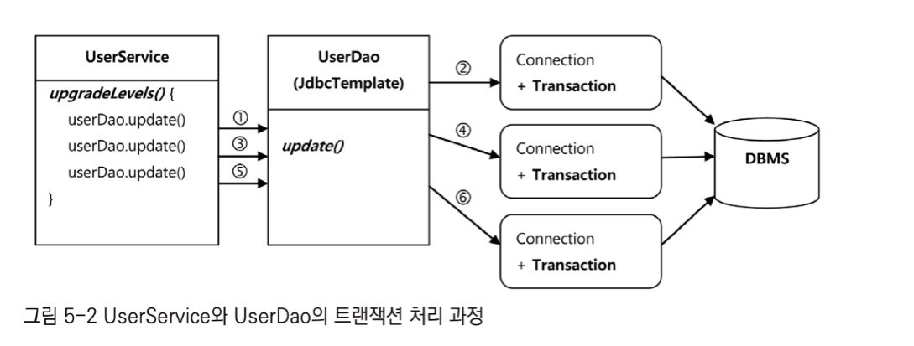
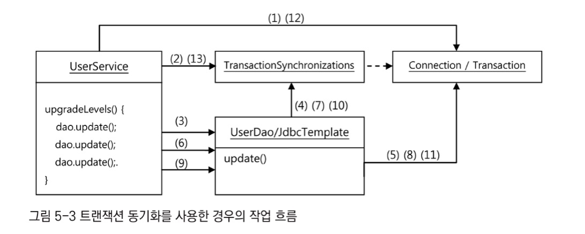
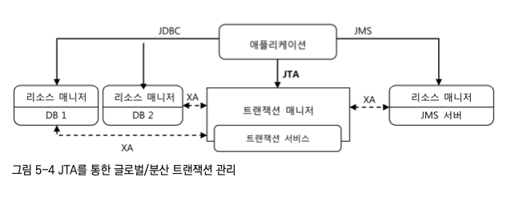
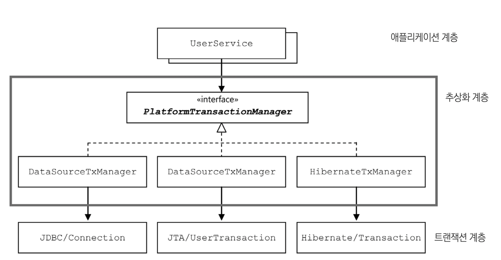
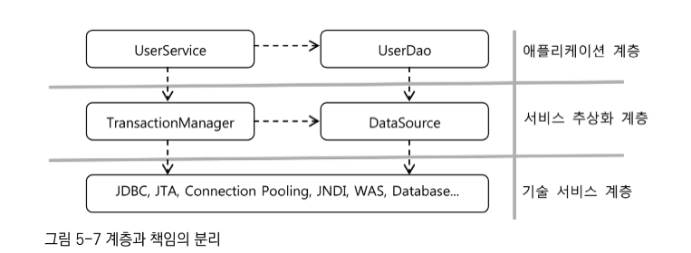
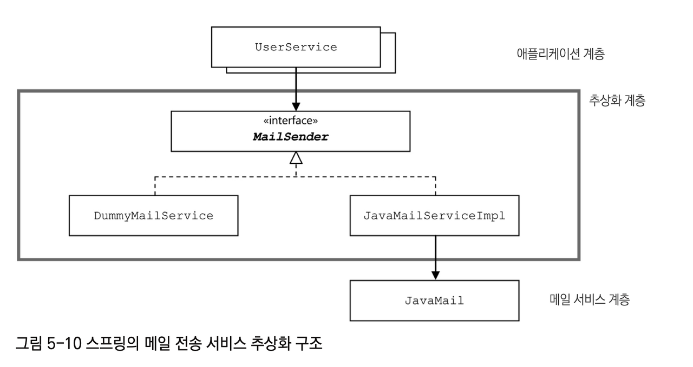

지금까지 만든 DAO에 트랜잭션을 적용해보면서 **스프링이 어떻게 성격이 비슷한 여러 종류의 기술을 추상화하고 이를 일관된 방법으로 사용할 수 있도록 지원하는지 살펴보자**

```
작성된 코드를 살펴볼 때는 다음과 같은 질문을 해볼 필요가 있다.

1. 코드에 중복된 부분은 없는가?
2. 코드가 무엇을 하는 것인지 이해하기 불편하지 않은가?
3. 코드가 자신이 있어야 할 자리에 있는가?
4. 앞으로 변경이 일어난다면 어떤 것이 있을 수 있고, 그 변화에 쉽게 대응할 수 있게 작성되어 있는가?

"데이터를 요구하지 말고 작업을 요청하라"
객체지향이 어쩌고 저쩌고 하는 설명이 불편하다면 단순히 "이렇게 만들면 코드를 더 이해하기 쉽고 변화에 대응하기가 편하구나"라고 생각해도 좋다.

적절하게 책임과 관심이 다른 코드를 분리하고, 서료 영향을 주지 않도록 다양한 추상화 기법을 도입하고, 애플리케이션 로직과 기술/환경을 분리하는 등의 작업은 갈수록 복잡해지는 엔터프라이즈 애플리케이션에서는 반드시 필요하다.

객체지향 설계와 프로그래밍의 원칙은 서로 긴밀하게 관련이 있다.
단일 책임 원칙을 잘 지키는 코드를 만들려면 인터페이스를 도입하고 이를 DI로 연결해야 하며,
그 결과로 단일 책임 원칙뿐 아니라 개방 폐쇄 원칙도 잘 지키고, 모듈간에 결합도가 낮아서 서로의 변경이 영향을 주지 않고,
같은 이유로 변경이 단일 책임에 집중되는 응집도 높은 코드가 나오니까 말이다. 그뿐인가?
이런 과정에서 "전략 패턴", "어댑터 패턴", "브리지 패턴", "미디에이터 패턴"등 많은 디자인 패턴이 자연스럽게 적용되기도 한다. 
```

# **5.1 사용자 레벨 관리 기능 추가**

1. 사용자의 레벨 `BASIC`, `SILVER`, `GOLD` 추가
2. 처음 가입시 `BASIC` 레벨, 이후 활동에 따라 한 단계식 업그레이드 된다.
3. 가입 후 50회 이상 로그인하면 `BASIC`에서 `SILVER`레벨이 된다.
4. `SILVER`레벨이면서 30번 이상 추천을 받으면 `GOLD`레벨이 된다.
5. 사용자 레벨의 변경 작업은 일정한 주기를 가지고 일괄적으로 진행된다.
   - 변경 작업 전에는 조건을 충족하더라도 레벨의 변경이 일어나지 않는다.

## 5.1.1 기능 추가에 필요한 필드 추가

1. (자바 5 이상에서 제공하는)`Enum` 클래스를 **Level**에 적용 [예제](https://github.com/jdalma/tobyspringin5/commit/128b736a289cb406731928283034bcbd2cf9a906)
2. **User** `level`,`login`,`recommend` 필드 추가 [예제](https://github.com/jdalma/tobyspringin5/commit/49380cfc3f1c189aff362d70fa6cf04b08207adf)
3. **UserDaoTest** 수정 [예제](https://github.com/jdalma/tobyspringin5/commit/564b1170123dfb03a0f0488a143c5f37de400596)
4. **UserDaoJdbc** 수정 [예제](https://github.com/jdalma/tobyspringin5/commit/0632818882ebf179e0f3258ef0bb520df58cfdf5)

## 5.1.2 `UserDaoJdbc.update()` 추가 [예제](https://github.com/jdalma/tobyspringin5/commit/a59f116627eeac644db380a3fff1da92cb90d60f)

## 5.1.3 `UserService.upgradeLevels()` 추가 

1. `UserService` 추가 [예제](https://github.com/jdalma/tobyspringin5/commit/4cd99b38a526086acaaf25cf76dc86dc17f39853)
2. `upgradeLevels()` 및 테스트 코드 추가 [예제](https://github.com/jdalma/tobyspringin5/commit/7fd4ec9f374979555a4292e216ec425a3dde1e4f)

## 5.1.4 `UserService.add()`추가 [예제](https://github.com/jdalma/tobyspringin5/commit/5bf00dea9db22b6f7ceeeba08fbddf4a9874b848)

처음 가입하는 사용자는 기본적으로 `BASIC`레벨을 가져야하는데 이 부분을 어디에 적용해야 할까?  
**UserDaoJdbc**는 주어진 `User`오브젝트를 DB에 정보를 넣고 읽는 방법에만 관심을 가져야지 비즈니스적인 의미를 포함시키는건 바람직하지 않다.  

**UserService**에서 이 책임을 가지게 하자  
`Level`필드에 값이 없을 때만 `BASCI`을 세팅하게 해주자  

## 5.1.5 코드 개선

작성된 코드를 살펴볼 때는 다음과 같은 질문을 해볼 필요가 있다.

1. 코드에 중복된 부분은 없는가?
2. 코드가 무엇을 하는 것인지 이해하기 불편하지 않은가?
3. 코드가 자신이 있어야 할 자리에 있는가?
4. 앞으로 변경이 일어난다면 어떤 것이 있을 수 있고, 그 변화에 쉽게 대응할 수 있게 작성되어 있는가?

### `UserService.upgradeLevels()`의 문제점 해결 [예제](https://github.com/jdalma/tobyspringin5/commit/69e90793edb020b5fca2b353061e121cb4fafff6)

- `for`루프 속에 들어있는 분기문이 보기 불편하다
  - 레벨의 변화 단계와 업그레이드 조건
  - 조건이 충족 됐을 때 해야할 작업
  - 플래그를 두고 적용할지 구분하는 작업
- 한데 섞여 있어서 로직을 이해하기가 쉽지 않다.

**코드가 깔끔해 보이지 않는 이유는 이렇게 성격이 다른 여러 가지 로직이 한데 섞여 있기 때문이다.**
객체지향적인 코드는 다른 오브젝트의 데이터를 가져와서 작업하는 대신 **데이터를 갖고 있는 다른 오브젝트에게 작업을 해달라고 요청한다.**  

1. `UserService`는 `User`에게 "레벨 업그레이드 작업을 해달라" 요청
2. `User`는 `Level`에게 "다음 레벨이 무엇인지 알려달라" 요청

위의 코드는 새로운 `Level`이 추가되거나, 레벨이 상승하는 조건이 변경되어도 어디를 손보면 되는지를 쉽게 알 수 있다.  

### `User`테스트 [예제](https://github.com/jdalma/tobyspringin5/commit/611bda06ad28b640cb7ddd214a54f3828e816cc0)

위에서 `User`에 로직을 담은 메소드를 추가했다.  
앞으로 계속 새로운 기능과 로직이 추가될 가능성이 있으니 테스트를 만들어두면 도움이 될 것이다!!

### `UserService` 테스트 코드 개선 및 업그레이드 정책 인터페이스 추가 [예제](https://github.com/jdalma/tobyspringin5/commit/5c9d1142115668399ff205c4012106700c1fd2f0)

# **5.2 트랜잭션 서비스 추상화**

> "정기 사용자 레벨 관리 작업을 수행하는 도중에 네트워크가 끊기거나 서버에 장애가 생겨서 작업을 완료할 수 없다면, 그때까지 변경된 사용자의 레벨은 그대로 둘까요? 아니면 모두 초기 상태로 되돌려 놓아야 할까요?"
> 문제가 발생해서 작업이 중단된다면 그때까지 진행된 변경 작업도 모두 취소시키도록 결정했다

## 5.2.1 모 아니면 도 [예제](https://github.com/jdalma/tobyspringin5/commit/bae21edbec070dcbb966a742a8cabeecfdddaef0)

지금은 작업 수행 도중에 에러가 발생하면 트랜잭션이 다 따로 동작하여 수정이 된 정보는 예외가 발생해도 롤백되지 않는다.  
- 테스트용 `UserService`클래스는 상속을 사용하여 만들자.  

## 5.2.2 트랜잭션 경계설정 

여러 개의 `SQL`이 사용되는 작업을 하나의 트랜잭션으로 취급해야 한다.  
**JDBC의 트랜잭션은 하나의 Connection을 가져와 사용하다가 닫는 사이에서 일어난다.**  
- 트랜잭션의 시작과 종료는 `Connection`오브젝트를 통해 이뤄진다.

JDBC의 기본설정은 DB 작업을 수행한 직후에 자동으로 커밋이 되도록 되어 있다.  
**트랜잭션이 한 번 시작되면 `commit()`또는 `rollback()` 메소드가 호출될 때 까지의 작업이 하나의 트랜잭션으로 묶인다**  
- `Connection.setAutoCommit(false)`로 트랜잭션의 시작을 선언하고 `commit()`또는 `rollback()`으로 트랜잭션을 종료하는 작업을 **트랜잭션의 경계설정**이라고 한다.
- 하나의 DB 커넥션 안에서 만들어지는 트랜잭션을 **로컬 트랜잭션**이라고 한다.

**JdbcTemplate**의 템플릿 메소드 호출 한 번에 한 개의 DB 커넥션이 만들어지고 닫히는 일이 일어난다.  
결국 **JdbcTemplate**을 사용하는 **UserDao**는 각 메소드마다 하나씩의 독립적인 트랜잭션으로 실행될 수 밖에 없다.  



`UserService`의 `upgradeLevels()`와 같이 여러 번 DB에 업데이트를 해야하는 작업을 하나의 트랜잭션으로 만들려면 어떻게 해야할까?

**`UserService`의 `upgradeLevels()`의 시작으로 트랜잭션이 시작하고 메소드를 빠져나올 때 트랜잭션이 종료되어야 한다.**  

## 5.2.3 트랜잭션 동기화 [예제](https://github.com/jdalma/tobyspringin5/commit/ef0005605ea833f03472414078c243a7d081e751) ⭐ 

`upgradeLevels()` 메소드에서 **트랜잭션 경계설정**을 해야한다.  
`Service` → `DAO`까지 `Connection`을 파라미터로 전달해 준다는건 말이 안된다.
스프링은 이 문제를 해결할 수 있는 방법을 제공한다.  

바로 **트랜잭션 동기화**이다.  
**`Connection`오브젝트를 특별한 저장소에 보관해두고, 이후에 호출되는 DAO의 메소드에서는 저장된 `Connection`을 가져다가 사용하게 하는 것이다.**  



1. `UserService`는 `Connection`을 생성
2. 이를 **트랜잭션 동기화 저장소**에 저장
3. 첫 번째 `update()` 메소드 호출
4. `update()` 내부의 JdbcTemplate은 **트랜잭션 동기화 저장소**에 현재 시작된 트랜잭션을 가진 `Connection`오브젝트가 존재하는지 확인
   - "2번"에서 저장된 `Connection`을 발견하고 이를 가져온다.
5. `Connection`을 이용해 `PreparedStatement`를 만들어 SQL을 실행
   - **트랜잭션 동기화 저장소**에서 가져온 `Connection`이라면 JdbcTemplate은 `Connection`을 닫지 않은 채로 작업을 마친다
   
이와 같은 행위가 반복되고 정상적으로 다 완료된다면 "12번" `UserService`가 `Connection`의 `commit()`을 호출해서 트랜잭션을 완료시킨다.
- 어느 작업 중에라도 예외상황이 발생하면 `UserService`는 즉시 `rollback()`을 호출하고 트랜잭션을 종료할 수 있다.
그리고 **트랜잭션 저장소**가 `Connection`오브젝트를 제거한다.  

```java
Connection c = DataSourceUtils.getConnection(dataSource);
```

`DataSource`에서 직접 `Connection`을 가져오지 않고, 스프링이 제공하는 `DataSourceUtils.getConnection(dataSource)`를 쓰는 이유는 `Connection`오브젝트를 생정해줄 뿐만 아니라 **트랜잭션 동기화에 사용하도록 저장소에 바인딩 해주기 때문이다.** 

## 5.2.4 트랜잭션 추상화 ⭐️

**기술과 환경에 종속되는 트랜잭션 경계설정 코드**  
하나의 트랜잭션에서 여러 개의 DB에 데이터를 넣는 작업을 해야한다면 어떻게 해야할까??  
- 로컬 트랜잭션은 `하나의 DB Connection에 종속`되기 때문에 불가능하다.

따라서 별도의 트랜잭션 관리자를 통해 트랜잭션을 관리하는 **글로벌 트랜잭션**방식을 사용해야 한다.  
트랜잭션 매니저를 통해 여러 개의 DB가 참여하는 작업을 하나의 트랜잭션으로 만들 수 있다.  
- **JMS**와 같은 트랜잭션 기능을 지원하는 서비스도 트랜잭션에 참여시킬 수 있다.  

자바는 JDBC 외에 이런 글로벌 트랜잭션을 지원하는 트랜잭션 매니저를 지원하기 위한 API인 **JTA**를 제공하고 있다.  



- 트랜잭션은 JDBC나 JMS API를 사용해서 직접 제어하지 않고 **JTA를 통한 트랜잭션 매너지가 관리하도록 위임한다.**
- 트랜잭션 매니저는 DB와 메시징 서버를 제어하고 관리하는 `각각의 리소스 매니저`와 `XA 프로토콜`을 통해 연결된다.
- **이를 통해 트랜잭션 매니저가 실제 DB와 메시징 서버의 트랜잭션을 종합적으로 제어할 수 있게 되는 것이다.**

문제는 **트랜잭션 동기화 저장소**를 사용하면서 현재 `UserService`는 JDBC에 종속적인 상황이다.  

> DB에서 제공하는 DB 클라이언트 라이브러리와 API는 서로 전혀 호환이 되지 않는 독자적인 방식으로 만들어져 있다.
> 하지만 모두 SQL을 이용하는 방식이라는 공통점이 있다. 이 "공통점을 뽑아내 추상화한 것이 JDBC"다.
> JDBC라는 추상화 기술이 있기 때문에 자바의 DB 프로그래밍 개발자는 DB의 종류에 상관없이 일관된 방법으로 데이터 엑세스 코드를 작성할 수가 있다.

**스프링은 트랜잭션 기술의 공통점을 담은 "트랜잭션 추상화 기술"을 제공하고 있다.**  
이를 이용하면 애플리케이션에서 직접 각 기술의 트랜잭션 API를 이용하지 않고도, 일관된 방식으로 트랜잭션 경계설정 작업이 가능해진다.    
**트랜잭션 추상화 기술**은 트랜잭션 동기화를 사용한다.  




```java
public void upgradeLevels() throws Exception {
    // JDBC 트랜잭션 추상 오브젝트 생성
    PlatformTransactionManager transactionManager =
            new DataSourceTransactionManager(dataSource);

    // 트랜잭션 시작
    TransactionStatus status = 
            transactionManager.getTransaction(new DefaultTransactionDefinition());

    try {
        List<User> users = userDao.getAll();
        for(User user : users) {
            if (userLevelService.canUpgradeLevel(user)) {
                userLevelService.upgradeLevel(user);
            }
        }
        transactionManager.commit(status);
    } catch (RuntimeException ex) {
        transactionManager.rollback(status);
        throw ex;
    }
}
```

- JDBC의 로컬 트랜잭션을 이용한다면 `PlatformTransactionManager`를 구현한 `DataSourceTransactionManager`를 사용하면 된다.
  - `PlatformTransactionManager`의 구현 클래스는 싱글톤으로 사용이 가능하다 
  - 사용할 DB의 `DataSource`를 생성자 파라미터 넘긴다
- `getTransaction()`을 호출하면 트랜잭션이 시작된다.
  - 필요에 따라 트랜잭션 매니저가 DB Connection을 가져오는 작업도 같이 수행한다.
- 파라미터로 넘기고 있는 `DefaultTransactionDefinition`은 트랜잭션에 대한 속성을 담고 있다.
- 이렇게 시작된 트랜잭션은 `TransactionStatus` 타입의 변수에 저장된다.
  - `TransactionStatus`의 트랜잭션에 대한 조작이 필요할 때 `PlatformTransactionManager`메소드의 파라미터로 전달해주면 된다.
- `PlatformTransactionManager.getTransaction()`으로 시작한 트랜잭션은 **트랜잭션 동기화 저장소**에 저장된다.
- `DataSourceTransactionManager` 오브젝트는 **JdbcTemplate**에서 사용될 수 있는 방식으로 트랜잭션을 관리해준다.
  - 따라서 `PlatformTransactionManager`를 통해 시작한 트랜잭션은 `UserDao`의 **JdbcTemplate**안에서 사용된다. 

### JTA를 이용하는 글로벌 트랜잭션으로 변경하려면 어떻게 해야 할까? [예제](https://github.com/jdalma/tobyspringin5/commit/79ac44b0de3228bfd5a25a53a12867bcdf9a23d9)

간단하다.  
**`PlatformTransactionManager` 구현 클래스를 `JTATransactionManager`로 바꿔주면 된다.**  
`JTATransactionManager`는 주요 자바 서버에서 제공하는 JTA정보를 JNDI를 통해 자동으로 인식하는 기능을 갖고 있다.  

# **5.3 수직, 수평 계층구조와 의존관계**

스프링의 **트랜잭션 서비스 추상화 기법**을 이용해 다양한 트랜잭션 기술을 일관된 방식으로 제어할 수 있게 되었다.

`UserDao`와 `UserService`는 관심에 따라 분리되고, 서로 불필요한 영향을 주지 않으며 독자적으로 확장이 가능하도록 만들었다.  
같은 애플리케이션을 담은 코드지만 내용에 따라 분리하여 **같은 계층에서 수평적인 분리**라고 볼 수 있다.  

트랜잭션의 추상화는 다르다.  
**애플리케이션의 비즈니스 로직과 그 하위에서 동작하는 로우레벨의 트랜잭션 기술이라는 아예 다른 계층의 특성을 갖는 코드를 분리한 것이다.**  



# **5.4 메일 서비스 추상화**

레벨이 업그레이드 되는 사용자에게는 안내 메일을 발송해달라는 요구사항이 들어왔다.  

## 5.4.1 JavaMail을 이용한 메일 발송 기능 [예제](https://github.com/jdalma/tobyspringin5/commit/b48b5c797b6e58b091afeb0305c7ab4662b9b9cb)

`javax.mail` 패키지에서 제공하는 자바의 이메일 클래스를 사용한다.  

## 5.4.2 JavaMail이 포함된 코드의 테스트

현재 이 메일 전송 기능은 메일 서버가 현재 연결 가능하도록 준비되어 있지 않기 때문에 통과하지 않는다.  
메일 서버가 준비되어 있다고 해도 테스트를 하면서 매번 메일이 발송되는 것이 바람직할까?  
**테스트 때는 메일 서버 설정을 다르게 해서 테스트용으로 따로 준비된 메일 서버를 이용하는 방법은 어떨까?**  

1. 메일 서버는 충분히 테스트된 시스템이다.
   - JavaMail은 자바의 표준 기술이고 이미 수많은 시스템에 사용돼서 검증된 안정적인 모듈이다.
2. SMTP로 메일 전송 요청을 받으면 별문제 없이 메일이 잘 전송됐다고 믿어도 충분하다.
3. 따라서 JavaMail을 통해 메일 서버까지만 메일이 잘 전달됐으면, 결국 사용자에게도 메일이 잘 보내졌을 것이라고 생각할 수 있다.

> SMTP라는 표준 메일 발송 프로토콜로 메일 서버에 요청이 전달되기만 하면 메일이 발송될 것이라고 믿고,
> 
> 실제 메일 서버가 아닌 테스트 용으로 따로 준비한 메일 서버를 사용해 테스트를 수행해도 좋다면,
> 
> **그 똑같은 원리를 UserService와 JavaMail 사이에도 적용할 수 있지 않을까?**

## 5.4.3 테스트를 위한 서비스 추상화 [예제](https://github.com/jdalma/tobyspringin5/commit/0d81ca7d0a5214138b045e9344ef627ad31e1704)

JavaMail과 같은 인터페이스를 갖는 오브젝트를 만들어서 사용하면 문제는 모두 해결된다.    
하지만 **JavaMail의 API에는 DataSource처럼 인터페이스로 만들어져서 구현을 바꿀 수 있는게 없다.**  

JavaMail에서는 `Session`을 만들어야만 메일 메시지를 생성할 수 있고, 메일을 전송할 수 있다.
- `Session`은 인터페이스가 아닌 클래스
- 생성자가 모두 `private`
- 스태틱 팩토리 메소드 밖에 없다
- `Session`은 더 이상 상속이 불가능한 `final`클래스
- JavaMail은 확장이나 지원이 불가능하도록 만들어진 가장 악명 높은 표준 API중의 하나로 알려져 있다.  

하지만 **JavaMail처럼 테스트 하기 힘든 구조인 API를 테스트하기 좋게 만드는 방법이 있다.**  
**서비스 추상화를 적용하면 된다.**
**스프링은 JavaMail을 사용해 만든 코드는 손쉽게 테스트하기 힘들다는 문제를 해결하기 위해서 JavaMail에 대한 추상화 기능을 제공하고 있다.**  

```java
/**
 * 이 인터페이스는 간단한 메일을 보내기 위한 전략을 정의합니다. 간단한 요구 사항으로 인해 다양한 메일링 시스템에 구현할 수 있습니다. 
 * MIME 메시지와 같은 더 풍부한 기능을 위해 JavaMailSender를 고려하십시오.
 * JavaMail의 인프라 클래스에 의존하지 않기 때문에 클라이언트를 쉽게 테스트할 수 있습니다. 
 * JavaMail 세션이나 전송을 조롱할 필요가 없습니다.
 */
public interface MailSender {

	void send(SimpleMailMessage simpleMessage) throws MailException;

	void send(SimpleMailMessage... simpleMessages) throws MailException;

}
```

이 인터페이스는 `SimpleMailMessage`라는 인터페이스를 구현한 클래스에 담긴 **메일 메시지를 전송하는 메소드로만 구성되어 있다.**  
**기본적으로는 JavaMail을 사용해 메일 발송 기능을 제공하는 `JavaMailSenderImpl`클래스를 이용하면 된다.**  



- 스프링이 제공하는 `MailSender` 인터페이스를 핵심으로 하는 메일 전송 서비스 추상화의 구조다.

**서비스 추상화 라고 하면** 트랜잭션과 같이 `기능은 유사하나 사용 방법이 다른 로우레벨의 다양한 기술에 대해 추상 인터페이스와 일관성 있는 접근 방법을 제공해주는 것`을 말한다.  
반면에, JavaMail의 경우처럼 테스트를 어렵게 만드는 건전하지 않은 방식으로 설계된 API를 사용할 때도 유용하게 쓰일 수 있다.  
특별히 `외부의 리소스와 연동하는 대부분 작업은 추상화의 대상이 될 수 있다.`

> 어뗜 경우에도 UserService와 같은 **애플리케이션 계층의 코드는 아래 계층에서는 어떤 일이 일어나는지 상관없이 메일 발송을 요청한다는 기본 기능에 충실하게 작성하면 된다.**  

하지만, 추가적인 문제가 있다. 메일 발송에 **트랜잭션을 적용시켜야 한다.**  

두 가지 방법을 사용할 수 있다.
1. 메일을 업그레이드할 사용자를 발견했을 때마다 발송하지 않고 발송 대상을 별도의 목록에 저장해둔다
   - 단점은 메일 저장 사용자 리스트를 파라미터로 계속 갖고 다녀야 한다.
2. `MailSender`를 확장해서 메일 전송에 트랜잭션 개념을 적용하는 것이다.
   - **MailSender를 구현한 트랜잭션 기능이 있는 메일 전송용 클래스를 만든다.**
   - 장점은 **서로 다른 종류의 작업을 분리해 처리한다는 면이다**

## 5.4.4 테스트 대역

위에서 메일 발송 작업 때문에 `UserService` 자체에 대한 테스트에 지장을 주지 않기 위해 도입한 것이 **`DummyMailSender`**다.  
아무런 기능도 없지만, `UserService`가 반드시 이용해야 하는 의존 오브젝트의 역할을 해주면서 원활하게 테스트 중에 `UserService`의 코드가 실행되게 해준다.  

이렇게 **테스트용으로 사용되는 특별한 오브젝트**들이 있다.  
테스트 환경을 만들어주기 위해, 테스트 대상이 되는 오브젝트의 기능에만 충실하게 수행하면서 빠르게, 자주 테스트를 실행할 수 있도록 사용하는 이런 오브젝트들을 통틀어서 **테스트 대역**이라고 한다.  

### 테스트 스텁

대표적인 테스트 대역은 **테스트 스텁**이다.  
`테스트 대상 오브젝트의 의존객체로서 존재하면서 테스트 동안에 코드가 정상적으로 수행할 수 있도록 돕는 것`을 말한다.  
- `DummyMailSender`는 가장 단순하고 심플한 테스트 스텁의 예다.

### 목 오브젝트 `upgradeLevles()` 테스트 코드에 적용 [예제](https://github.com/jdalma/tobyspringin5/commit/d30308725b9115478b7a5a5ee9388898999d619a)

테스트 대상의 간접적인 출력 결과를 검증하고, 테스트 대상 오브젝트와 의존 오브젝트 사이에서 일어나는 일을 검증할 수 있도록 특별히 설계된 **목 오브젝트가** 있다.  
스텁 처럼 테스트 오브젝트가 정상적으로 실행되도록 도와주면서, `테스트 오브젝트와 자신의 사이에서 일어나는 커뮤니케이션 내용을 저장해뒀다가 테스트 겸과를 검증하는 데 활용`할 수 있게 해준다.

1. 테스트 대상 오브젝트가 의존 오브젝트에게 출력한 값에 관심이 있을 경우
2. 의존 오브젝트를 얼마나 사용했는지 커뮤니케이션 행위 자체에 관심이 있을 경우

목 오브젝트를 사용해서 `upgradeLevels()` 테스트에서 조건을 만족하는 사용자의 레벨을 수정했다면, **메일도 보내졌는지 알아보자**  
