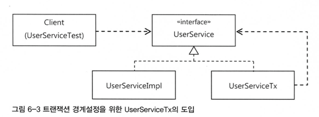

**AOP**는 IoC/DI, 서비스 추상화와 더불어 스프링의 3대 기반기술의 하나다.  
AOP는 스프링의 기술 중에서 가장 이해하기 힘든 난해한 용어와 개념을 가진 기술로 악명이 높다.  

1. 필연적인 등장배경
2. 스프링이 그것을 도입한 이유
3. 얻을 수 있는 장점

에 대해 충분한 이해가 필요하다.  

```
테스트는 다시 코드의 품질을 높여주고, 리팩토링과 개선에 대한 용기를 주기도 할 것 이다.
반대로 좋은 코드를 만들려는 노력을 게을리하면 테스트 작성이 불편해지고, 테스트를 잘 만들지 않게 될 가능성이 높아진다.

스프링을 사용한다면 단위 테스트를 만들어야 할 테고, 단위 테스트를 만든다면 목 오브젝트는 자주 필요하다.
따라서 Mockito와 같은 목 오브젝트 지원 프레임워크 하나 쯤은 익숙하게 사용할 수 있도록 학습해두자.
```


# **6.1 트랜잭션 코드의 분리**

`UserService`에는 비즈니스 로직에 대해서만 책임이 있어야하는데 트랜잭션 경계설정 부분이 못마땅하다.  

## 6.1.1 메소드 분리 [예제](https://github.com/jdalma/tobyspringin5/commit/9137979148a248ebcc099d95352b1cac322d2f4a)

`UserService.upgradeLevels()`는 **비즈니스 로직 코드를 사이에 두고 트랜잭션 시작과 종료를 담당하는 코드가 앞뒤에 위치**하고 있다.  
또, **트랜잭션 경계설정의 코드와 비즈니스 로직 코드 간에 서로 주고바는 정보가 없다는 점**이다.  
완벽하게 독립적인 코드다.  

> 이 비즈니스 로직을 담당하는 코드가 트랜잭션의 시작과 종료 사이에서 수행하기만 하면 된다.

## 6.1.2 `UserServiceTx`클래스를 의존관계에 추가하여 트랜잭션 경계설정 분리 [예제](https://github.com/jdalma/tobyspringin5/commit/5ef2402bc904cf63888f15111b7ff7833f08593a)

비즈니스 로직과 트랜잭션 로직은 직접적인 정보를 서로 주고받는 것이 없다면 트랜잭션 로직을 클래스 밖으로 뽑아내자.  



1. `UserService` 인터페이스, `UserServiceImpl` 구현체 분리
2. `UserService` 인테퍼이스의 구현체 `UserServiceTx` 추가
3. `UserServiceTx`는 `UserServiceImpl`을 주입받는다
   - `UserServiceTx`는 사용자 관리라는 비즈니스 로직을 전혀 갖지 않고 고스란히 다른 `UserService`구현 오브젝트에 기능을 위임한다.
4. 트랜잭션의 경계설정 작업은 `UserServiceTx`에 부여한다

> 클라이언트가 `UserService` 인터페이스를 통해 사용자 관리 로직을 이용하려고 할 때
> 
> 먼저 트랜잭션을 담당하는 오브젝트가 사용돼서 트랜잭션에 관련된 작업을 진행해주고,
> 
> 실제 사용자 관리 로직을 담은 오브젝트가 이후에 호출돼서 비즈니스 로직에 관련된 작업을 수행하도록 만든다.

- 기존 `upgradeAllOrNothing()` 트랜잭션 테스트 코드는 `UserServiceTx`에 `UserServiceOnlyTest`오브젝트를 주입하여 `UserServiceTx`를 통해 테스트 코드를 진행하도록 수정하였다.

# **6.2 고립된 단위 테스트**

가장 좋은 테스트 방법은 가능한 한 작은 단위로 쪼개서 테스트하는 것이다.  
테스트 단위가 작아야 테스트의 의도나 내용이 분명해지고, 만들기도 쉬워진다.  

```
                                             ➚  UserDao          ➚  UserDao
                                ➚ UserService ➙ UserLevelService ➙ JavaMail
UserServiceTest ➙ UserServiceTx ➙ UserServiceOnlyTest ➙ MockMailSender
                                ➘ PlatformTransactionManager 

```

테스트의 대상이 환경이나, 외부 서버, 다른 클래스의 **코드에 종속되고 영향을 받지 않도록 고립시킬 필요가 있다.**  
`MailSender`에 적용해봤던 대로 테스트를 위한 대역을 사용하는 것이다.  

## 테스트를 위한 `UserServiceImpl` 고립

주입받고 있는 `UserDao`와 `UserLevelUpgradePolicy`를 고립시켜보자.  
`UserDao`와 같은 역할을 하면서`UserServiceImpl`과의 사이에서 주고받은 정보를 저장해뒀다가, 테스트의 검증에 사용할 수 있게하는 **목 오브젝트**를 만들 필요가 있다.  

`upgradeLevels()`에서 `UserDao`를 사용하는 경우는 두 가지이다.
1. `userDao.getAll()`에 대해서는 **스텁**으로서,
2. `userDao.update(user)`에 대해서는 **목 오브젝트**로서

위의 두 가지로서 동작하는 `UserDao`타입의 테스트 대역 `MockUserDao`를 추가하자.
- **[Mock은 Stub이 아니다(Mocks Aren't Stubs)](https://jaime-note.tistory.com/330)**

1. [`MockUserDao` 추가](https://github.com/jdalma/tobyspringin5/commit/7d73039a45a04fb88f8472d70f0a05772b52ec53)
2. [`upgradeLevels()` 테스트 `MockUserDao` 적용](https://github.com/jdalma/tobyspringin5/commit/e324f3934d36c62991ab0cbe287aa5911e4a04fc)

DB를 사용하였을 때의 테스트 시간은 **803ms**<br>
`MockUserDao`를 적용하였을 때는 **1ms**걸렸다.<br>

## 단위 테스트와 통합 테스트 어떻게 고려할 것인가? ⭐️

단위 테스트의 단위는 정하기 나름이다. **중요한 것은 하나의 단위에 초점을 맞춘 테스트라는 점이다.** <br>

이 책에서는 앞으로 `upgradeLevels()` 테스트처럼  
**"테스트 대상 클래스를 목 오브젝트 등의 테스트 대역을 이용해 의존 오브젝트나 외부의 리소스응 사용하지 않도록 고립시켜서 테스트하는 것"**을 `단위 테스트`라고 부르겠다.  
반면에 **"두 개 이상의, 성격이나 계층이 다른 오브젝트가 연동하도록 만들어 테스트하거나, 외부의 DB나 파일, 서비스등의 리소스가 참여하는 테스트"**는 `통합 테스트`라고 부르겠다.

1. 항상 단위 테스트를 먼저 고려한다.
2. 필요에 따라 스텁이나 목 오브젝트 등의 테스트 대역을 이용하도록 테스트를 만든다.
3. 외부 리소스를 사용해야만 가능한 테스는 통합 테스트로 만든다.
4. DAO는 JDBC를 통해 실행하는 코드만으로는 고립된 테스트를 작성하기가 힘들다.
   - 작성한다고 해도 가치가 없는 경우가 대부분이다.
   - 따라서 **DAO는 DB까지 연동하는 테스트로 만드는 편이 효과적이다.**
   - **DAO 테스트는 DB라는 외부 리소스를 사용하기 때문에 통합 테스트로 분류된다.**
   - DAO를 테스트를 통해 충분히 검증해두면, DAO를 이용하는 코드는 DAO 역할을 스텁이나 목 오브젝트로 대체해서 테스트할 수 있다.
5. **여러 개의 단위가 의존관계를 가지고 동작할 때를 위한 통합 테스트는 필요하다.**
   - 다만, 단위 테스트를 충분히 거쳤다면 통합 테스트의 부담은 상대적으로 줄어든다.
6. **단위 테스트를 만들기가 너무 복잡하다고 판단되는 코드는 처음부터 통합 테스트를 고려해본다.**
   - 이때도 통합 테스트에 참여하는 코드 중에서 가능한 한 많은 부분을 미리 단위 테스트로 검증해두는게 유리하다.
7. 스프링 테스트 컨텍스트 프레임워크를 이용하는 테스트는 통합 테스트다.

## Mockito 프레임워크 [예제](https://github.com/jdalma/tobyspringin5/commit/9ce22a80d5ddc4c196e625dd0ddcf2c6d61442dc)

간단한 메소드 호출만으로 다이내믹하게 특정 인터페이스를 구현한 테스트용 목 오브젝트를 만들 수 있다.  
**Mockito**를 통해 만들어진 **목 오브젝트는 메소드의 호출과 관련된 모든 내용을 자동으로 저장해두고, 이를 간단한 메소드로 검증할 수 있게 해준다.**

1. 인터페이스를 이용해 목 오브젝트를 만든다.
2. 목 오브젝트의 리턴값을 지정해준다.
3. 테스트 대상 오브젝트에 DI해서 목 오브젝트가 테스트 중에 사용되도록 만든다.
4. 테스트 대상 오브젝트를 사용한 후에 목 오브젝트의 특정 메소드가 호출됐는지, 어떤 값을 가지고 몇 번 호출했는지를 검증한다.

파라미터를 직접 비교하기 보다는 파라미터의 내부 정보를 확인해야 하는 경우 `ArgumentCaptor`사용하면 유용하다.


# **6.3 다이내믹 프록시와 팩토리 빈** ⭐️

단순히 확장성을 고려해서 한 가지 기능을 분리한다면 전형적인 전략 패턴을 사용하면 된다.  
**트랜잭션 기능에는 추상화 작업을 통해 이미 전략 패턴이 적용되어 있다.**  
하지만 `전략 패턴으로는 트랜잭션 기능의 구현 내용을 분리해냈을 뿐이다.`    
구체적인 구현 코드는 제거했을지라도 **위임을 통해 기능을 사용하는 코드는 핵심 코드와 함께 남아있다.**  

`UserService`는 **핵심기능(비즈니스 로직)** 을 담당하고 `UserServiceTx`는 **부가기능(트랜잭션 처리 기능)** 을 담당하면서 **핵심기능**을 DI를 통해 호출하는 담당도 가지게 했다.  
문제는 이렇게 구성했더라도 클라이언트가 핵심기능을 직접 사용해버리면 부가기능이 적용될 기회가 없다는 것이다.  

그래서 부가기능은 마치 **자신이 핵심기능을 가진 클래스인 것처럼 꾸며서, 클라이언트가 자신을 거쳐서 핵심기능을 사용하도록 만들어야 한다.**  
그러기 위해서는 **클라이언트는 인터페이스를 통해서만 핵심기능을 사용하게 하고, 부가기능은 자신도 같은 인터페이스를 구현한 뒤에 자신이 그 사이에 끼어들어야 한다.** 


- **부가기능 코드에서는 핵심기능으로 요청을 위임해주는 과정에서 자신이 가진 부가적인 기능을 적용해줄 수 있다.**
- 비즈니스 로직 코드에 트랜잭션 기능을 부여해주는 것이 바로 그런 대표적인 경우다.

이렇게 마치 **자신이 클라이언트가 사용하려고 하는 실제 대상인 것처럼 위장해서 클라이언트의 요청을 받아주는 것**을 `대리자`,`대리인`
과 같은 역할을 한다고 해서 **프록시**라고 부른다.
그리고 프록시를 통해 최종적으료 요청을 위임받아 처리하는 실제 오브젝트를 **타깃**또는 **실체**라고 부른다.  

프록시의 특징은 **타깃과 같은 인터페이스를 구현했다는 것과 프록시가 타깃을 제어할 수 있는 위치에 있다는 것**이다.  
프록시는 사용 목적에 따라 두 가지로 구분할 수 있다.

1. 클라이언트가 타깃에 접근하는 방법을 제어하기 위해
2. 타깃에 부가적인 기능을 부여해주기 위해

목적에 따라서 디자인 패턴에서는 다른 패턴으로 구분한다.

## 데코레이터 패턴

**타깃에 부가적인 기능을 런타임 시 다이내믹하게 부여해주기 위해 프록시를 사용하는 패턴을 말한다.**  
- 즉 `코드상에서는 어떤 방법과 순서로 프록시와 타깃이 연결되어 사용되는지 정해져 있지 않다는 뜻`

데코레이터 패턴에서는 프록시가 꼭 한 개로 제한되지 않는다.  
프록시가 여러 개인 만큼 `순서를 정해서 단계적으로 위임하는 구조`로 만들면 된다.

프록시로서 동작하는 각 데코레이터는 위임하는 대상에도 인터페이스로 접근하기 때문에 자신이 최종 타깃으로 위임하는지,
아니면 다음 단계의 데코레이터 프록시로 위임하는지 알지 못한다.
그래서 데코레이터의 **다음 위임 대상은 인터페이스로 선언하고 생성자나 수정자 메소드를 통해 위임 대상을 외부에서 런타임 시에 주입받을 수 있도록 만들어야 한다.**
- 자바 IO 패키지의 `InputStream`과 `OutputStream` 구현 클래스는 데코레이터 패턴이 사용된 대표적인 예다.

`UserService` 인터페이스를 구현한 **타깃인 `UserServiceImpl`**에 트랜잭션 부가기능을 제공해주는 `UserServiceTx`를 추가한 것도 데코레이터 패턴을 적용했다고 볼 수 있다.  

## 프록시 패턴

`일반적으로 사용하는 프록시`는 **클라이언트와 사용 대상 사이에 대리 역할을 맡은 오브젝트를 두는 방법을 총칭**  
디자인패턴에서 말하는 `프록시 패턴`은 **프록시를 사용하는 방법 중에 타깃에 대한 접근 방법을 제어하려는 목적**을 가진 경우를 가리킨다.  

프록시 패턴의 프록시는 **타깃의 기능을 확장허간 추가하지 않는다.**  
대신 **클라이언트가 타깃에 접근하는 방식을 변경해준다.**  
타깃 오브젝트를 생성하기가 복잡하거나 당장 필요하지 않은 경우에는 꼭 필요한 시점까지 오브젝트를 생성하지 않는 편이 좋다 (`Lazy`)  
그런데 타깃 오브젝트에 대한 레퍼런스가 미리 필요할 수 있다. **이럴 때 프록시 패턴을 적용하면 된다.**  

**실제 타깃 오브젝트를 만드는 대신 프록시를 넘겨주는 것, 그리고 프록시의 메소드를 통해 타깃을 사용하려고 시도하면, 그떄 프록시가 타깃 오브젝트를 생성하고 요청을 위임해주는 식이다.**  
또는 특별한 상황에서 **타깃에 대한 접근권한**을 제어하기 위해 프록시 패턴을 사용할 수 있다.  
- 만약 수정 가능한 오브젝트가 있는데, 특정 레이어로 넘어가서는 읽기전용으로만 동작하게 강제해야한다고 하자.
- 이럴 때는 오브젝트의 프록시를 만들어서 사용할 수 있다.
- `Collections`의 `unmodifiableCollection()`을 통해 만들어지는 오브젝트가 전형적인 접근권한 제어용 프록시라고 볼 수 있다.

**이렇게 프록시 패턴은 타깃의 기능 자체에는 관여하지 않으면서 접근하는 방법을 제어해주는 프록시를 이용하는 것이다.**  
앞으로는
1. 타깃과 동일한 인터페이스를 구현하고
2. 클라이언트와 타깃 사이에 존재하면서
3. 기능의 부가 또는 접근 제어를 담당하면
모두 **프록시**라고 부르겠다.  

## 다이내믹 프록시

프록시를 만드는 일이 상당히 번거롭게 느껴진다.  
매번 새로운 클래스를 정의해야하고, 인터페이스의 구현해야 할 메소드를 일일이 클래스로 정의하는 것이 번거롭다.  

그렇다면, 목 오브젝트를 만드는 불편함을 목 프레임워크를 사용해 편리하게 바꿧던 것처럼 프록시도 일일이 모든 인터페이스를 구현해서 새로 정의하지 않는 방법은 없을까?    
기본적인 아이디어는 목 프레임워크와 비슷하다. **일일이 프록시 클래스를 정의하지 않고도 몇 가지 API를 이용해 프록시처럼 동작하는 오브젝트를 다이내믹하게 생성 (`JDK의 다이내믹 프록시`) 하는 것이다.**    

프록시는 다음 두 가지 기능으로 구성된다.
1. `타깃과 같은 메소드를 구현하고 있다가 메소드가 호출되면 타깃 오브젝트로 위임한다.`
2. `지정된 요청에 대해서는 부가 기능을 수행한다.`

## 리플렉션

**다이내믹 프록시는 리플렉션 기능을 이용해서 프록시를 만들어준다.**  
- 리플렉션은 자바의 코드 자체를 추상화해서 접근하도록 만든 것

자바의 모든 클래스는 그 클래스 자체의 구성정보를 담은 `Class 타입`의 오브젝트를 하나씩 갖고 있다.  
`Class`오브젝트를 이용하면 **클래스 코드에 대한 메타정보**를 가져오거나 **오브젝트를 조작**할 수 있다.  
- [참고](https://jdalma.github.io/docs/java/reflection/)


```java
public static void main(String[] args) throws NoSuchMethodException, InvocationTargetException, IllegalAccessException {
    Method lengthMethod = String.class.getMethod("length");
    System.out.println(lengthMethod.invoke("test"));
}
```

- 위와 같이 특정 메소드를 가져와 실행시킬 수도 있다.

## 프록시 클래스 [예제](https://github.com/jdalma/tobyspringin5/commit/e432b3806705f9a54bedd22a529fcf6e609de020)

**다이내믹 프록시를 이용한 프록시를 만들어보자**  

`Hello`인터페이스를 구현한 프록시를 만들어보자  
프록시에는 데코레이터 패턴을 적용해서 타깃인 `HelloTarget`에 부가기능을 추가해보자  
프록시의 이름은 `HelloUppercase`이며, 리턴하는 문자를 모두 대문자로 바꾸는 것  
- 이 프록시는 프록시 적용의 일반적인 문제점 두 가지를 모두 갖고 있다.

1. 인터페이스의 모든 메소드를 구현해 타깃에게 위임하도록 만들어야한다.
2. 부가기능인 리턴 값을 대문자로 바꾸는 기능이 모든 메소드에 중복돼서 나타난다.

### 다이나믹 프록시 적용
