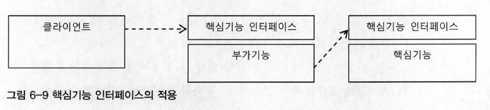
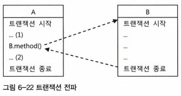

**AOP**는 IoC/DI, 서비스 추상화와 더불어 스프링의 3대 기반기술의 하나다.  
AOP는 스프링의 기술 중에서 가장 이해하기 힘든 난해한 용어와 개념을 가진 기술로 악명이 높다.  

1. 필연적인 등장배경
2. 스프링이 그것을 도입한 이유
3. 얻을 수 있는 장점

에 대해 충분한 이해가 필요하다.  

```
테스트는 다시 코드의 품질을 높여주고, 리팩토링과 개선에 대한 용기를 주기도 할 것 이다.
반대로 좋은 코드를 만들려는 노력을 게을리하면 테스트 작성이 불편해지고, 테스트를 잘 만들지 않게 될 가능성이 높아진다.

스프링을 사용한다면 단위 테스트를 만들어야 할 테고, 단위 테스트를 만든다면 목 오브젝트는 자주 필요하다.
따라서 Mockito와 같은 목 오브젝트 지원 프레임워크 하나 쯤은 익숙하게 사용할 수 있도록 학습해두자.

"스프링은 컨테이너로서 제공하는 기능 중에서 변하지 않는 핵심적인 부분 외에는 대부분 확장할 수 있도록 확장 포인트를 제공해준다."
```


# **6.1 트랜잭션 코드의 분리**

`UserService`에는 비즈니스 로직에 대해서만 책임이 있어야하는데 트랜잭션 경계설정 부분이 못마땅하다.  

## 6.1.1 메소드 분리 [예제](https://github.com/jdalma/tobyspringin5/commit/9137979148a248ebcc099d95352b1cac322d2f4a)

`UserService.upgradeLevels()`는 **비즈니스 로직 코드를 사이에 두고 트랜잭션 시작과 종료를 담당하는 코드가 앞뒤에 위치**하고 있다.  
또, **트랜잭션 경계설정의 코드와 비즈니스 로직 코드 간에 서로 주고바는 정보가 없다는 점**이다.  
완벽하게 독립적인 코드다.  

> 이 비즈니스 로직을 담당하는 코드가 트랜잭션의 시작과 종료 사이에서 수행하기만 하면 된다.

## 6.1.2 `UserServiceTx`클래스를 의존관계에 추가하여 트랜잭션 경계설정 분리 [예제](https://github.com/jdalma/tobyspringin5/commit/5ef2402bc904cf63888f15111b7ff7833f08593a)

비즈니스 로직과 트랜잭션 로직은 직접적인 정보를 서로 주고받는 것이 없다면 트랜잭션 로직을 클래스 밖으로 뽑아내자.  


1. `UserService` 인터페이스, `UserServiceImpl` 구현체 분리
2. `UserService` 인테퍼이스의 구현체 `UserServiceTx` 추가
3. `UserServiceTx`는 `UserServiceImpl`을 주입받는다
   - `UserServiceTx`는 사용자 관리라는 비즈니스 로직을 전혀 갖지 않고 고스란히 다른 `UserService`구현 오브젝트에 기능을 위임한다.
4. 트랜잭션의 경계설정 작업은 `UserServiceTx`에 부여한다

> 클라이언트가 `UserService` 인터페이스를 통해 사용자 관리 로직을 이용하려고 할 때
> 
> 먼저 트랜잭션을 담당하는 오브젝트가 사용돼서 트랜잭션에 관련된 작업을 진행해주고,
> 
> 실제 사용자 관리 로직을 담은 오브젝트가 이후에 호출돼서 비즈니스 로직에 관련된 작업을 수행하도록 만든다.

- 기존 `upgradeAllOrNothing()` 트랜잭션 테스트 코드는 `UserServiceTx`에 `UserServiceOnlyTest`오브젝트를 주입하여 `UserServiceTx`를 통해 테스트 코드를 진행하도록 수정하였다.

# **6.2 고립된 단위 테스트**

가장 좋은 테스트 방법은 가능한 한 작은 단위로 쪼개서 테스트하는 것이다.  
테스트 단위가 작아야 테스트의 의도나 내용이 분명해지고, 만들기도 쉬워진다.  

```
                                             ➚  UserDao          ➚  UserDao
                                ➚ UserService ➙ UserLevelService ➙ JavaMail
UserServiceTest ➙ UserServiceTx ➙ UserServiceOnlyTest ➙ MockMailSender
                                ➘ PlatformTransactionManager 

```

테스트의 대상이 환경이나, 외부 서버, 다른 클래스의 **코드에 종속되고 영향을 받지 않도록 고립시킬 필요가 있다.**  
`MailSender`에 적용해봤던 대로 테스트를 위한 대역을 사용하는 것이다.  

## 테스트를 위한 `UserServiceImpl` 고립

주입받고 있는 `UserDao`와 `UserLevelUpgradePolicy`를 고립시켜보자.  
`UserDao`와 같은 역할을 하면서`UserServiceImpl`과의 사이에서 주고받은 정보를 저장해뒀다가, 테스트의 검증에 사용할 수 있게하는 **목 오브젝트**를 만들 필요가 있다.  

`upgradeLevels()`에서 `UserDao`를 사용하는 경우는 두 가지이다.
1. `userDao.getAll()`에 대해서는 **스텁**으로서,
2. `userDao.update(user)`에 대해서는 **목 오브젝트**로서

위의 두 가지로서 동작하는 `UserDao`타입의 테스트 대역 `MockUserDao`를 추가하자.
- **[Mock은 Stub이 아니다(Mocks Aren't Stubs)](https://jaime-note.tistory.com/330)**

1. [`MockUserDao` 추가](https://github.com/jdalma/tobyspringin5/commit/7d73039a45a04fb88f8472d70f0a05772b52ec53)
2. [`upgradeLevels()` 테스트 `MockUserDao` 적용](https://github.com/jdalma/tobyspringin5/commit/e324f3934d36c62991ab0cbe287aa5911e4a04fc)

DB를 사용하였을 때의 테스트 시간은 **803ms**<br>
`MockUserDao`를 적용하였을 때는 **1ms**걸렸다.<br>

## 단위 테스트와 통합 테스트 어떻게 고려할 것인가? ⭐️

단위 테스트의 단위는 정하기 나름이다. **중요한 것은 하나의 단위에 초점을 맞춘 테스트라는 점이다.** <br>

이 책에서는 앞으로 `upgradeLevels()` 테스트처럼  
**"테스트 대상 클래스를 목 오브젝트 등의 테스트 대역을 이용해 의존 오브젝트나 외부의 리소스응 사용하지 않도록 고립시켜서 테스트하는 것"**을 `단위 테스트`라고 부르겠다.  
반면에 **"두 개 이상의, 성격이나 계층이 다른 오브젝트가 연동하도록 만들어 테스트하거나, 외부의 DB나 파일, 서비스등의 리소스가 참여하는 테스트"**는 `통합 테스트`라고 부르겠다.

1. 항상 단위 테스트를 먼저 고려한다.
2. 필요에 따라 스텁이나 목 오브젝트 등의 테스트 대역을 이용하도록 테스트를 만든다.
3. 외부 리소스를 사용해야만 가능한 테스는 통합 테스트로 만든다.
4. DAO는 JDBC를 통해 실행하는 코드만으로는 고립된 테스트를 작성하기가 힘들다.
   - 작성한다고 해도 가치가 없는 경우가 대부분이다.
   - 따라서 **DAO는 DB까지 연동하는 테스트로 만드는 편이 효과적이다.**
   - **DAO 테스트는 DB라는 외부 리소스를 사용하기 때문에 통합 테스트로 분류된다.**
   - DAO를 테스트를 통해 충분히 검증해두면, DAO를 이용하는 코드는 DAO 역할을 스텁이나 목 오브젝트로 대체해서 테스트할 수 있다.
5. **여러 개의 단위가 의존관계를 가지고 동작할 때를 위한 통합 테스트는 필요하다.**
   - 다만, 단위 테스트를 충분히 거쳤다면 통합 테스트의 부담은 상대적으로 줄어든다.
6. **단위 테스트를 만들기가 너무 복잡하다고 판단되는 코드는 처음부터 통합 테스트를 고려해본다.**
   - 이때도 통합 테스트에 참여하는 코드 중에서 가능한 한 많은 부분을 미리 단위 테스트로 검증해두는게 유리하다.
7. 스프링 테스트 컨텍스트 프레임워크를 이용하는 테스트는 통합 테스트다.

## Mockito 프레임워크 [예제](https://github.com/jdalma/tobyspringin5/commit/9ce22a80d5ddc4c196e625dd0ddcf2c6d61442dc)

간단한 메소드 호출만으로 다이내믹하게 특정 인터페이스를 구현한 테스트용 목 오브젝트를 만들 수 있다.  
**Mockito**를 통해 만들어진 **목 오브젝트는 메소드의 호출과 관련된 모든 내용을 자동으로 저장해두고, 이를 간단한 메소드로 검증할 수 있게 해준다.**

1. 인터페이스를 이용해 목 오브젝트를 만든다.
2. 목 오브젝트의 리턴값을 지정해준다.
3. 테스트 대상 오브젝트에 DI해서 목 오브젝트가 테스트 중에 사용되도록 만든다.
4. 테스트 대상 오브젝트를 사용한 후에 목 오브젝트의 특정 메소드가 호출됐는지, 어떤 값을 가지고 몇 번 호출했는지를 검증한다.

파라미터를 직접 비교하기 보다는 파라미터의 내부 정보를 확인해야 하는 경우 `ArgumentCaptor`사용하면 유용하다.


# **6.3 다이내믹 프록시와 팩토리 빈** ⭐⭐⭐️

단순히 확장성을 고려해서 한 가지 기능을 분리한다면 전형적인 전략 패턴을 사용하면 된다.  
**트랜잭션 기능에는 추상화 작업을 통해 이미 전략 패턴이 적용되어 있다.**  
하지만 `전략 패턴으로는 트랜잭션 기능의 구현 내용을 분리해냈을 뿐이다.`    
구체적인 구현 코드는 제거했을지라도 **위임을 통해 기능을 사용하는 코드는 핵심 코드와 함께 남아있다.**  

`UserService`는 **핵심기능(비즈니스 로직)** 을 담당하고 `UserServiceTx`는 **부가기능(트랜잭션 처리 기능)** 을 담당하면서 **핵심기능**을 DI를 통해 호출하는 담당도 가지게 했다.  
문제는 이렇게 구성했더라도 클라이언트가 핵심기능을 직접 사용해버리면 부가기능이 적용될 기회가 없다는 것이다.  

그래서 부가기능은 마치 **자신이 핵심기능을 가진 클래스인 것처럼 꾸며서, 클라이언트가 자신을 거쳐서 핵심기능을 사용하도록 만들어야 한다.**  
그러기 위해서는 **클라이언트는 인터페이스를 통해서만 핵심기능을 사용하게 하고, 부가기능은 자신도 같은 인터페이스를 구현한 뒤에 자신이 그 사이에 끼어들어야 한다.** 



- **부가기능 코드에서는 핵심기능으로 요청을 위임해주는 과정에서 자신이 가진 부가적인 기능을 적용해줄 수 있다.**
- 비즈니스 로직 코드에 트랜잭션 기능을 부여해주는 것이 바로 그런 대표적인 경우다.

이렇게 마치 **자신이 클라이언트가 사용하려고 하는 실제 대상인 것처럼 위장해서 클라이언트의 요청을 받아주는 것**을 `대리자`,`대리인`
과 같은 역할을 한다고 해서 **프록시**라고 부른다.
그리고 프록시를 통해 최종적으료 요청을 위임받아 처리하는 실제 오브젝트를 **타깃**또는 **실체**라고 부른다.  

프록시의 특징은 **타깃과 같은 인터페이스를 구현했다는 것과 프록시가 타깃을 제어할 수 있는 위치에 있다는 것**이다.  
프록시는 사용 목적에 따라 두 가지로 구분할 수 있다.

1. 클라이언트가 타깃에 접근하는 방법을 제어하기 위해
2. 타깃에 부가적인 기능을 부여해주기 위해

목적에 따라서 디자인 패턴에서는 다른 패턴으로 구분한다.

## 데코레이터 패턴

**타깃에 부가적인 기능을 런타임 시 다이내믹하게 부여해주기 위해 프록시를 사용하는 패턴을 말한다.**  
- 즉 `코드상에서는 어떤 방법과 순서로 프록시와 타깃이 연결되어 사용되는지 정해져 있지 않다는 뜻`

데코레이터 패턴에서는 프록시가 꼭 한 개로 제한되지 않는다.  
프록시가 여러 개인 만큼 `순서를 정해서 단계적으로 위임하는 구조`로 만들면 된다.

프록시로서 동작하는 각 데코레이터는 위임하는 대상에도 인터페이스로 접근하기 때문에 자신이 최종 타깃으로 위임하는지,
아니면 다음 단계의 데코레이터 프록시로 위임하는지 알지 못한다.
그래서 데코레이터의 **다음 위임 대상은 인터페이스로 선언하고 생성자나 수정자 메소드를 통해 위임 대상을 외부에서 런타임 시에 주입받을 수 있도록 만들어야 한다.**
- 자바 IO 패키지의 `InputStream`과 `OutputStream` 구현 클래스는 데코레이터 패턴이 사용된 대표적인 예다.

`UserService` 인터페이스를 구현한 **타깃인 `UserServiceImpl`** 에 트랜잭션 부가기능을 제공해주는 `UserServiceTx`를 추가한 것도 데코레이터 패턴을 적용했다고 볼 수 있다.  

## 프록시 패턴

`일반적으로 사용하는 프록시`는 **클라이언트와 사용 대상 사이에 대리 역할을 맡은 오브젝트를 두는 방법을 총칭**  
디자인패턴에서 말하는 `프록시 패턴`은 **프록시를 사용하는 방법 중에 타깃에 대한 접근 방법을 제어하려는 목적**을 가진 경우를 가리킨다.  

프록시 패턴의 프록시는 **타깃의 기능을 확장하거나 추가하지 않는다.**  
대신 **클라이언트가 타깃에 접근하는 방식을 변경해준다.**  
타깃 오브젝트를 생성하기가 복잡하거나 당장 필요하지 않은 경우에는 꼭 필요한 시점까지 오브젝트를 생성하지 않는 편이 좋다 (`Lazy`)  
그런데 타깃 오브젝트에 대한 레퍼런스가 미리 필요할 수 있다. **이럴 때 프록시 패턴을 적용하면 된다.**  

**실제 타깃 오브젝트를 만드는 대신 프록시를 넘겨주는 것, 그리고 프록시의 메소드를 통해 타깃을 사용하려고 시도하면, 그떄 프록시가 타깃 오브젝트를 생성하고 요청을 위임해주는 식이다.**  
또는 특별한 상황에서 **타깃에 대한 접근권한**을 제어하기 위해 프록시 패턴을 사용할 수 있다.  
- 만약 수정 가능한 오브젝트가 있는데, 특정 레이어로 넘어가서는 읽기전용으로만 동작하게 강제해야한다고 하자.
- 이럴 때는 오브젝트의 프록시를 만들어서 사용할 수 있다.
- `Collections`의 `unmodifiableCollection()`을 통해 만들어지는 오브젝트가 전형적인 접근권한 제어용 프록시라고 볼 수 있다.

**이렇게 프록시 패턴은 타깃의 기능 자체에는 관여하지 않으면서 접근하는 방법을 제어해주는 프록시를 이용하는 것이다.**  
앞으로는
1. 타깃과 동일한 인터페이스를 구현하고
2. 클라이언트와 타깃 사이에 존재하면서
3. 기능의 부가 또는 접근 제어를 담당하면
모두 **프록시**라고 부르겠다.  

## 다이내믹 프록시

프록시를 만드는 일이 상당히 번거롭게 느껴진다.  
매번 새로운 클래스를 정의해야하고, 인터페이스의 구현해야 할 메소드를 일일이 클래스로 정의하는 것이 번거롭다.  

그렇다면, 목 오브젝트를 만드는 불편함을 목 프레임워크를 사용해 편리하게 바꿧던 것처럼 프록시도 일일이 모든 인터페이스를 구현해서 새로 정의하지 않는 방법은 없을까?    
기본적인 아이디어는 목 프레임워크와 비슷하다. **일일이 프록시 클래스를 정의하지 않고도 몇 가지 API를 이용해 프록시처럼 동작하는 오브젝트를 다이내믹하게 생성 (`JDK의 다이내믹 프록시`) 하는 것이다.**    

프록시는 다음 두 가지 기능으로 구성된다.
1. `타깃과 같은 메소드를 구현하고 있다가 메소드가 호출되면 타깃 오브젝트로 위임한다.`
2. `지정된 요청에 대해서는 부가 기능을 수행한다.`

## 리플렉션

**다이내믹 프록시는 리플렉션 기능을 이용해서 프록시를 만들어준다.**  
- 리플렉션은 자바의 코드 자체를 추상화해서 접근하도록 만든 것

자바의 모든 클래스는 그 클래스 자체의 구성정보를 담은 `Class 타입`의 오브젝트를 하나씩 갖고 있다.  
`Class`오브젝트를 이용하면 **클래스 코드에 대한 메타정보**를 가져오거나 **오브젝트를 조작**할 수 있다.  
- [참고](https://jdalma.github.io/docs/java/reflection/)


```java
public static void main(String[] args) throws NoSuchMethodException, InvocationTargetException, IllegalAccessException {
    Method lengthMethod = String.class.getMethod("length");
    System.out.println(lengthMethod.invoke("test"));
}
```

- 위와 같이 특정 메소드를 가져와 실행시킬 수도 있다.

## 프록시 클래스 [예제](https://github.com/jdalma/tobyspringin5/commit/e432b3806705f9a54bedd22a529fcf6e609de020)

**다이내믹 프록시를 이용한 프록시를 만들어보자**  

`Hello`인터페이스를 구현한 프록시를 만들어보자  
프록시에는 데코레이터 패턴을 적용해서 타깃인 `HelloTarget`에 부가기능을 추가해보자  
프록시의 이름은 `HelloUppercase`이며, 리턴하는 문자를 모두 대문자로 바꾸는 것  
- 이 프록시는 프록시 적용의 일반적인 문제점 두 가지를 모두 갖고 있다.

1. 인터페이스의 모든 메소드를 구현해 타깃에게 위임하도록 만들어야한다.
2. 부가기능인 리턴 값을 대문자로 바꾸는 기능이 모든 메소드에 중복돼서 나타난다.

### 다이나믹 프록시 적용 [예제](https://github.com/jdalma/tobyspringin5/commit/35095f89b068c2a9009007c3ac44ac43b43313c8)

`HelloUppercase`를 **다이내믹 프록시**로 만들어보자.  


**다이내믹 프록시**는 **프록시 팩토리**에 의해 런타임시 다이내믹하게 타깃의 인터페이스와 같은 타입으로 만들어지는 오브젝트다.  
클라이언트는 다이내믹 프록시 오브젝트를 타깃 인터페이스를 통해 사용할 수 있다.  
이 덕분에 프록시를 만들 때 인터페이스를 모두 구현해가면서 클래스를 정의하는 수고를 덜 수 있다.  
- **프록시 팩토리**에게 인터페이스 정보만 제공하면 해당 인터페이스를 구현한 클래스의 오브젝트를 자동으로 만들어주기 때문이다.

프록시로서 필요한 부가기능 제공 코도는 직접 작성해야 한다.  
부가기능은 프록시 오브젝트와 독립적으로 `InvocationHandler`를 구현한 오브젝트에 담는다.  
- `InvocationHandler` : 아래와 같이 메소드 한 개만 가진 인터페이스다.

```java
/**
 * InvocationHandler 는 프록시 인스턴스의 호출 핸들러 에 의해 구현된 인터페이스입니다.
 * 각 프록시 인스턴스에는 연관된 호출 핸들러가 있습니다. 
 * 프록시 인스턴스에서 메서드가 호출되면 메서드 호출이 인코딩되어 해당 호출 핸들러의 invoke 메서드로 전달됩니다.
 */
public interface InvocationHandler {
   /**
    * 프록시 인스턴스에서 메서드 호출을 처리하고 결과를 반환합니다. 
    * 이 메서드는 연결된 프록시 인스턴스에서 메서드가 호출될 때 호출 핸들러에서 호출됩니다.
    */
    public Object invoke(Object proxy, Method method, Object[] args)
        throws Throwable;
}
```

- `invoke()`는 리플렉션의 `Method`인터페이스를 파라미터로 받는다.
- 메소드를 호출할 때 전달되는 파라미터도 `args`로 받는다.

**다이내믹 프록시 오브젝트**는 `클라이언트의 모든 요청을 리플렉션 정보로 변환`해서 **`InvocationHandler`구현 오브젝트**의 `invoke()`메소드로 넘기는 것이다.  
**`InvocationHandler` 구현 오브젝트**가 `타깃 오브젝트 레퍼런스를 갖고 있다면 리플렉션을 이용해 간단히 위임 코드를 만들어 낼 수 있다.`  


1. `Hello` 인터페이스를 제공하면서 프록시 팩토리에게 다이내믹 프록시를 만들어 달라고 요청
2. 모든 메소드를 구현한 오브젝트를 생성
3. 다이내믹 프록시가 받는 모든 요청을 `InvocationHandler`의 `invoke(Method)`로 보낸다


```java
Hello dynamicProxiedHello = (Hello) Proxy.newProxyInstance(
       getClass().getClassLoader(),    // 1. 동적으로 생성되는 다이내믹 프록시 클래스의 로딩에 사용할 클래스 로더
       new Class[] {Hello.class},      // 2. 구현할 인터페이스
       new UppercaseHandler(new HelloTarget()));   // 3. 부가기능과 위임 코드를 담은 InvocationHandler

assertThat(dynamicProxiedHello.sayHello(name)).isEqualTo("HELLO " + name);
assertThat(dynamicProxiedHello.sayHi(name)).isEqualTo("HI " + name);
assertThat(dynamicProxiedHello.sayThankYou(name)).isEqualTo("THANK YOU " + name);
```

사용 방법을 자세히보자
1. 다이내믹 프록시가 정의되는 클래스 로더를 지정하는 것 🚩
2. 다이내믹 프록시가 구현해야 할 인터페이스
   1. 한 번에 하나 이상의 인터페이스를 구현할 수도 있다.
3. 부가기능과 위임관련 코드를 담고 있는 **`InvocationHandler` 구현 오브젝트**


## 다이내믹 프록시의 확장 [예제](https://github.com/jdalma/tobyspringin5/commit/060bdc3213eaff95e2b509e59025e38c0283c1dc)

`UppercaseHandler`는 모든 메소드의 리턴 타입이 스트링이라고 가정한다.    
**스트링 외의 리턴 타입을 갖는 메소드가 추가되면 어떨까?**  

리플렉션은 매우 유연하고 막강한 기능을 가진 대신에 주의 깊게 사용할 필요가 있다.  
그래서 **`Method`를 이용한 타깃의 오브젝트의 메소드 호출 후 리턴 타입을 확인**해서 스트링인 경우만 대문자로 바꿔주고 나머지는 그대로 리턴하는 방식으로 수정하자.  

> `InvocationHandler`는 단일 메소드 `invoke()`에서 모든 요청을 처리하기 때문에 어떤 메소드에 어떤 기능을 적용할지를 선택하는 과정이 필요할 수도 있다.
> 
> 호출하는 메소드의 이름, 파라미터의 개수와 타입, 리턴 타입 등의 정보를 가지고 부가적인 기능을 적용할 메소드를 선택할 수 있다.

## 다이내믹 프록시를 이용한 트랜잭션 부가기능 ⭐️ [예제](https://github.com/jdalma/tobyspringin5/commit/2c56adc3ea824f3238d9d9c8cdc3f70b18a5377d)

드디어 **`UserServiceTx`를 다이내믹 프록시 방식으로 변경해보자**  
**다이내믹 프록시**와 연동해서 **트랜잭션 기능을 부가해주는 `InvocationHandler`** 는 한 개만 정의해도 충분하다.    

> 리플렉션 메소드인 `invoke()`를 이용해 타깃 오브젝트의 메소드를 호출할 때는 타깃 오브젝트에서 발생하는 예외가 `InvocationTargetException`으로 한 번 포장돼서 전달된다.
> 
> 따라서 `InvocationTargetException`으로 받은 후 `getTargetException()` 메소드로 중첩되어 있는 예외를 가져와야 한다.

## 다이내믹 프록시를 위한 팩토리 빈 ⭐

이제 `TransactionHandler`와 **다이내믹 프록시**를 **스프링의 DI를 통해 사용할 수 있도록** 만들어야 한다.  
**다이내믹 프록시 오브젝트는 일반적인 스프링의 빈으로는 등록할 방법이 없다..**
- 스프링의 빈은 기본적으로 **클래스 이름과 프로퍼티로 정의된다.**
- **지정된 클래스의 이름을 가지고 리플렉션을 이용해서 해당 클래스의 오브젝트를 만든다.**
- 스프링은 내부적으로 리플렉션 API를 사용해서 빈 정의에 나오는 클래스 이름을 가지고 Bean 오브젝트를 생성한다.

문제는 다이내믹 프록시 오브젝트는 이런 식으로 프록시 오브젝트가 생성되지 않는다는 점이다.  
**사전에 프록시 오브젝트의 클래스 정보를 미리 알아내서 스프링의 빈에 정의할 방법이 없다.**  
- `Proxy`는 `Proxy.newInstance()`라는 스태틱 팩토리 메소드를 통해서만 만들 수 있다.

### **팩토리 빈**

스프링은 클래스 정보를 가지고 디폴트 생성자를 통해 오브젝트를 만드는 방법 외에도 빈을 만드는 방벙을 제공한다.  
**대표적으로 팩토리 빈을 이용한 생성 방법이다.**  

**팩토리 빈이란?**
- 스프링을 대신해서 오브젝트의 생성로직을 담당하도록 만들어진 특별한 빈을 말한다.
- 전형적인 팩토리 메소드를 가진 오브젝트다. 
- **스프링은 `FactoryBean` 인터페이스를 구현한 클래스가 Bean의 클래스로 지정되면 팩토리 빈 클래스의 오브젝트의 `getObject()`를 통해 오브젝트를 가져오고, 이를 빈 오브젝트로 사용한다.**
  - Bean 오브젝트를 생성하는 과정에서만 사용될 뿐이다.
  
팩토리 빈을 만드는 가장 간단한 방법은 **스프링의 `FactoryBean` 인터페이스를 구현**하는 것이다.  

```java
public interface FactoryBean<T> {
	String OBJECT_TYPE_ATTRIBUTE = "factoryBeanObjectType";

	@Nullable
	T getObject() throws Exception;

	@Nullable
	Class<?> getObjectType();

	default boolean isSingleton() {
		return true;
	}
}
```
- [`Spring docs` FactoryBean](https://docs.spring.io/spring-framework/docs/current/javadoc-api/org/springframework/beans/factory/FactoryBean.html)

> **`FactoryBean` 인터페이스를 구현한 클래스를 스프링의 빈으로 등록하면 팩토리 빈으로 동작한다.**

### 팩토리 빈 학습 테스트 [예제](https://github.com/jdalma/tobyspringin5/commit/9238c441028b72d26be669418ef0785beec80c8d)

스프링은 `private`생성자를 가진 클래스도 리플렉션을 이용하여 오브젝트를 만들어준다.  
하지만 일반적으로 `private`생성자를 가진 클래스를 빈으로 등록하는 일은 권장되지 않으며, 등록하더라도 올바르게 동작하지 않을 가능성이 있다.  
클래스에 **스태틱 팩토리 메소드**를 추가하여 `private`생성자를 사용하지 않고 오브젝트를 생성해주는 **팩토리 빈 클래스를 만들어보자**  

> 드물지만 팩토리 빈이 만들어주는 빈 오브젝트가 아니라 **팩토리 빈 자체를 가져오고 싶을 수 있다.**
> 
> 이럴 때를 위해 스프링은 `&`를 빈 이름앞에 붙여주면 팩토리 빈 자체를 돌려준다.


## 트랜잭션 프록시를 팩토리 빈을 통해 스프링 빈으로 등록 [예제](https://github.com/jdalma/tobyspringin5/commit/eaad41017bb3955971107e40a079bf1b9c03736b) ⭐

`Proxy.newProxyInstance()`를 통해서만 생성이 가능한 다이내믹 프록시 오브젝트는 일반적인 방법으로는 스프링의 빈으로 등록할 수 없다.  
위에서 학습하였듯이 **팩토리 빈의 `getObject()`에서 다이내믹 프록시 오브젝트를 생성하여 주면 스프링 빈으로 등록이 가능하다.**  


테스트 코드 작성 시 이와 같은 경우 이미 스프링 빈으로 만들어진 트랜잭션 프록시 오브젝트의 타깃을 변경해주기는 어렵다.    
`TxProxyFactoryBean`를 직접 가져와서 `target` 프로퍼티를 테스트 대상으로 재구성한 뒤에 프록시 오브젝트를 생성하도록 하자.  

## 프록시 팩토리 빈 방식의 장점과 한계

**장점**  
1. `TxProxyFactoryBean`의 재사용성
2. DI 빈 설정만으로 다양한 타깃 오브젝트에 적용 가능

**단점**
1. 한 번에 여러 개의 클래스에 공통적인 부가기능을 제공해야 한다면?
   - 비즈니스 로직을 담은 많은 클래스의 메소드에 적용할 필요가 있다면 팩토리 빈의 설정이 중복되는 것을 막을 수 없다
2. 하나의 타깃에 여러 개의 부가기능을 적용해야 한다면?
   - 비슷한 설정이 자꾸 반복된다
3. `TransactionHandler` 오브젝트가 프록시 팩토리 빈 개수만큼 만들어진다
   - `TransactionHandler`는 **타깃 오브젝트를 프로퍼티로 가지고 있다**

**`TransactionHandler`의 중복을 없애고 모든 타깃에 적용 가능한 싱글톤 빈으로 만들어서 적용할 수는 없을까?**  

# **6.4 스프링의 프록시 팩토리 빈**

## ProxyFactoryBean 

스프링은 트랜잭션 기술과 메일 발송 기술에 적용했던 **서비스 추상화를 프록시 기술에도 동일하게 적용하고 있다.**  
자바에는 JDK에서 제공하는 다이내믹 프록시 외에도 **편리하게 프록시를 만들 수 있도록 지원해주는 다양한 기술이 존재한다.**  
따라서 `스프링은 일관된 방법으로 프록시를 만들 수 있게 도와주는 "추상 레이어"를 제공한다.`  
- **프록시 오브젝트를 생성해주는 기술을 추상화한 팩토리 빈을 제공한다.**
- 일반적으로는 JDK가 제공하는 다이내믹 프록시를 만들어주지만, 경우에 따라서 CGLIB이라고 하는 오픈소스 바이트 코드 생성 프레임워크를 이용하기도 한다

`ProxyFactoryBean`은 프록시를 생성해서 빈 오브젝트로 등록하게 해주는 팩토리 빈이다.  
- 여러 개의 `MethodInterceptor`를 추가할 수 있다
- 여러 개의 부가기능을 제공해주는 프록시를 만들 수 있다

**순수하게 프록시를 생성하는 작업만을 담당하고 프록시를 통해 제공해줄 부가기능은 별도의 빈에 둘 수 있다.**  
- `MethodInterceptor`인터페이스를 구현해서 만든다

> 이전 방식에서는 만약 타깃이 다르고 메소드 선정방식이 다르다면 `InvocationHandler` 오브젝트를 여러 프록시가 공유할 수 없다
>
> 타깃과 메소드 선정은 DI를 통해 분리할 수는 있지만 한번 빈으로 구성된 InvocationHandler오브젝트는, 오브젝트 차원에서 특정 타깃을 위한 프록시에 제한된다는 뜻이다.

### 어드바이스 : 타깃이 필요없는 순수한 부가기능 ⭐ [예제](https://github.com/jdalma/tobyspringin5/commit/f825f8a45d1453afc5df538e22699baa6db38b57)

`MethodInterceptor`와 `InvocationHandler`는 한 가지 차이점이 있다.  
`InvocationHandler`를 구현해서 사용할 때는 **타깃 오브젝트를 직접 알고있어야 했다.**
- `method.invoke(target , args)`

반면에 `MethodInterceptor`의 `invoke()`는 **ProxyFactoryBean으로부터 타깃 오브젝트에 대한 정보까지도 함께 제공받는다.**   
- `MethodInterceptor`로 메소드 정보와 함께 타깃 오브젝트가 담긴 `MethodInvocation` 오브젝트가 전달된다
- `MethodInvocation`은 **타깃 오브젝트의 메소드를 실행시킬 수 있는 기능이 있기 때문에 `MethodInterceptor`는 부가기능에만 집중할 수 있다.**

그리고 `Hello.class`라는 인터페이스를 제공해주지 않아도 된다. 어떻게 인터페이스 타입을 받지 않고 해당 인터페이스를 구현한 프록시를 만들어낼 수 있을까?  
- `ProxyFactoryBean.setInterfaces()`를 통해 전달 해줄 수 있긴 하다.

굳이 알려주지 않아도 **인터페이스 자동검출 기능**을 사용해 타깃 오브젝트가 구현하고 있는 인터페이스 정보를 알아낸다
그리고 알아낸 인터페이스를 모두 구현하는 프록시를 만들어준다.

위와 같은 이유 덕분에 **타깃 오브젝트에 상관없이 독릭접으로 만들어질 수 있다.**
`ProxyFactoryBean`은 작은 단위의 **템플릿/콜백** 구조를 응용해서 적용했기 때문에 템플릿 역할을 하는 `MethodInvocation`을 싱글톤으로 두고 공유할 수 있다.  

스프링은 단순히 메소드 실행을 가로채는 방식 외에도 부가기능을 추가하는 여러 가지 다양한 방법을 제공하고 있다.  
**타깃 오브젝트에 적용하는 부가기능을 담은 오브젝트를 스프링에서는 `어드바이스`라고 부른다.**    

### 포인트컷 : 프록시 적용 대상 메소드 선정 방법 [예제](https://github.com/jdalma/tobyspringin5/commit/55084287c17537febef617fcdc3e844fba72831d)

이전에는 메소드의 이름이 `pattern`에 해당하는지 비교하고 부가기능을 실행시켰다.  
**`MethodInterceptor`는 `InvocationHandler`와는 다르게 프록시가 클라이언트로부터 받는 요청을 일일이 전달받을 필요는 없다.**  

프록시의 핵심 가치는 타깃을 대신해서 클라이언트의 요청을 받아 처리하는 오브젝트로서의 존재 자체이므로,  
메소드를 선별하는 기능은 프록시로부터 다시 분리하는 것이 낫다.  


- 스프링의 `ProxyFactoryBean`방식은 **부가기능**과 **메소드 선정 알고리즘**을 활용하는 유연한 구조를 제공한다
- 메소드 선정 알고리즘을 담은 오브젝트를 **포인트컷**이라고 부른다.
- **어드바이스**와 **포인트컷**은 프록시에 `DI`로 주입되어 사용된다
  - 두 가지 모두 여러 프록시에서 공유가 가능하도록 만들어지기 때문에 스프링의 싱글톤 빈으로 등록이 가능하다

<br>

1. 프록시는 클라이언트로부터 요청을 받으면 먼저 포인트컷에게 부가기능을 부여할 메소드인지 확인을 요청
   - `Pointcut`인터페이스를 구현하여 만든다
2. 부가기능을 적용할 대상 메소드라면 `MethodInterceptor`타입의 어드바이스를 호출한다
   - 이전과 달리 직접 타깃을 호출하지 않는다.
   - `methodInvocation.proceed()`

따라서 타깃에 직접 의존하지 않도록 일종의 템플릿 구조로 설계되어 있으며,  
어드바이스가 부가기능을 부여하는 중에 타깃 메소드의 호출이 필요하면 프록시로 부터 전달받은 `MethodInvocation`타입 콜백 오브젝트의 `proceed()`를 호출해주기만 하면 된다.

> 실제 위임 대상인 타깃 오브젝트의 레퍼런스를 갖고 있고, 이를 이용해 타깃 메소드를 직접 호출하는 것은 "프록시가 메소드 호출에 따라 만드는 `Invocation 콜백`의 역할이다.
> 
> 재사용 가능한 기능을 만들어두고 "바뀌는 부분 (콜백 오브젝트와 메소드 호출정보)"만 외부에서 주입해서 이를 "작업 흐름 (부가기능 부여)" 중에 사용하도록 하는 전형적인 템플릿/콜백 구조다.

```java
// 포인트컷과 어드바이스를 Advisor로 묶어서 한 번에 추가
pfBean.addAdvisor(new DefaultPointcutAdvisor(pointcut, new UppercaseAdvice()));
```

포인트컷을 함께 등록할 때는 어드바이스와 포인트컷을 `Advisor`타입으로 묶어서 전달해야한다.  
왜 별개의 오브젝트를 묶어서 등록할까?  
그 이유는 **여러 개의 어드바이스와 포인트컷이 추가될 수 있기 때문에 "이 포인트컷은 이 어드바이스에 적용한다"** 라고 알리기 위해서다    
이렇게 어드바이스와 포인트컷을 묶은 오브젝트를 **어드바이저**라고 한다.  

```
어드바이저 = 포인트컷 (메소드 선정 알고리즘) + 어드바이스 (부가기능)
```

## ProxyFactoryBean 적용 [예제](https://github.com/jdalma/tobyspringin5/commit/43f8fc23baaef87aafec8385317565a2affcdad3)

1. `TransactionAdvice` 추가
   - `MethodInterceptor`라는 `Advice` 서브 인터페이스를 구현해서 만든다
2. `@Bean` 설정
   - 트랜잭션 어드바이스, 포인트컷 추가
   - 어드바이저, 프록시 팩토리 빈 추가
3. 테스트

얼핏보면 복잡해보이지만 **어드바이스와 포인트컷은 재사용가능하기 때문에 복잡해진것은 아니다.**
`ProxyFactoryBean`은 스프링의 DI와 템플릿/콜백 패턴, 서비스 추상화 등의 기법이 모두 적용된 것이다.  
새로운 비즈니스 로직이 추가되어도 `TransactionAdvice`를 그대로 재사용할 수 있다.  


# **6.5 AOP**

지금까지 해왔던 작업의 목표는 비즈니스 로직에 반복적으로 등장해야만 했던 트랜잭션 코드를 깔끔하고 효과적으로 분리해내는 것이다.  

## 자동 프록시 생성

한 가지 불편한 점이 있다.  
**부가기능의 적용이 필요한 타깃 오브젝트마다 거의 비슷한 내용의 `ProxyFactoryBean` 빈 설정정보를 추가해주는 것이다.**  
`target`을 제외하면 빈 클래스의 종류, 어드바이스, 포인트컷의 설정이 거의 동일한데 이러한 중복을 제거할 수 있는 방법은 없을까?  

### 빈 후처리기를 이용한 자동 프록시 생성기

`BeanPostProcessor` 인터페이스를 구현해서 만드는 **빈 후처리기**다.  
말 그대로 스프링 빈 오브젝트로 만들어지고 난 후에, 빈 오브젝트를 다시 가공할 수 있게 해준다.  
- **빈 후처리기의 구조와 자세한 사용법은 Vol.2에서..**

여기서는 스프링이 제공하는 빈 후처리기 중의 하나인 `DefaultAdvisorAutoProxyCreator`를 살펴보자.  
- 자동 프록시 생성기다.
- 빈 오브젝트의 프로퍼티를 강제로 수정할 수도있고, 별도의 초기화 작업을 수행할 수도 있다.
- 빈 후처리기 자체를 빈으로 등록하면 적용할 수 있다

이를 잘 이용하면 **스프링이 생성하는 빈 오브젝트의 일부를 프록시로 포장하고, 프록시를 빈으로 대신 등록할 수도 있다.**  


1. 빈 후처리기가 등록되어 있다면 스프링 컨테이너는 빈 생성 후 후처리기에게 빈을 보낸다
2. `DefaultAdvisorAutoProxyCreator`는 빈으로 등록된 모든 어드바이저 내의 포인트컷을 이용해 **프록시 적용 대상인지 확인**한다
   - 빈 후처리기는 **클래스와 메소드 선정 알고리즘을 모두 갖고 있는 포인트컷이 필요하다.**
3. **적용 대상이면 내장된 프록시 생성기에게 현재 빈에 대한 프록시를 만들게 하고, 만들어진 프록시에 어드바이저를 연결해준다.**
4. 빈 후처리기는 처음에 전달받은 빈이 아니라 **프록시 오브젝트를 컨테이너에게 돌려준다.**

### 포인트컷 : 프록시 적용 대상 클래스 선정 방법 [예제](https://github.com/jdalma/tobyspringin5/commit/3b75efd7799c68f31d8ec648310d40fd32d7b19e)

포인트컷은 두 가지 기능을 모두 갖고 있다.  

```java
public interface Pointcut {
	ClassFilter getClassFilter();       // 프록시를 적용할 클래스인지 확인
	MethodMatcher getMethodMatcher();   // 어드바이스를 적용할 메소드인지 확인
}
```
- `NameMatchMethodPointcut`은 메소드 선별 기능만 가진 포인트컷이다.
- 메소드만 선별한다는 것은 모든 클래스를 다 받도록 만들어져 있다.


```java
// 포인트컷 준비
NameMatchMethodPointcut classMethodPointcut = new NameMatchMethodPointcut() {
   @Override
   public ClassFilter getClassFilter() {
       return new ClassFilter() {
           @Override
           public boolean matches(Class<?> clazz) {
               // 클래스 이름이 HelloT로 시작하는 것만
               return clazz.getSimpleName().startsWith("HelloT");
           }
       };
   }
};

// 메소드 이름이 SayH로 시작하는 것만
classMethodPointcut.setMappedName("sayH*");
```

## `DefaultAdvisorAutoProxyCreator`의 적용 [예제](https://github.com/jdalma/tobyspringin5/commit/a125d6bf54d2037d22848ec46924f5746f97f466)

적용할 자동 프록시 생성기인 `DefaultAdvisorAutoProxyCreator`은 등록된 빈 중에서 `Advisor`인터페이스를 구현한 것을 모두 찾는다.  
그리고 생성되는 모든 빈에 대해 어드바이저의 포인트컷을 적용해보면서 프록시 적용 대상을 선정한다.

1. `NamedMatchMethodPointcut`을 상속해서 프로퍼티로 주어진 이름 패턴을 가지고 클래스 이름을 비교하는 `ClassFilter`를 추가하도록 작성
2. `@Bean`설정 수정
   - `ProxyFactoryBean` 제거
   - 서비스 빈 원상복구
   - 더 이상 명시적인 프록시 팩토리 빈을 등록하지 않기 때문에 `Service`는 당당하게 그 자체로 등록이 가능하다.
3. 테스트 코드 수정
   - 이제 스프링 컨테이너가 프록시를 적용하여 주므로,
   - `upgradeAllOrNothing()` 테스트를 위한 `UserServiceOnlyTest`클래스를 빈으로 등록하자

## 포인트컷 표현식을 이용한 포인트컷

지금까지 사용했던 포인트컷은 `메소드의 이름`과 `클래스의 이름 패턴`을 각각 클래스 필터와 메소드 매처 오브젝트로 비교해서 선정하는 방식이였다.  
이보다 더 복잡하고 세밀한 기준을 이용하려면 어떻게 해야할까?  
스프링은 아주 간단하고 효과적인 방법으로 포인트컷의 클래스와 메소드를 선정하는 알고리즘을 작성할 수 있는 **포인트컷 표현식**을 제공한다.  

포인트컷 표현식을 지원하는 포인트컷을 적용하려면 `AspectJExpressionPointcut`클래스를 사용하면 된다.  
- 클래스와 메소드의 선정 알고리즘을 포인트컷 표현식을 이용해 한 번에 지정할 수 있게 해준다.
- `AspectJ`라는 유명한 프레임워크에서 제공하는 것을 가져와 일부 문법을 확장해서 사용하는 것이다
- 그래서 **AspectJ 포인트컷 표현식**이라고도 한다.

**490p ~ 512p 정리 필요** 🚩


# **6.6 트랜잭션 속성** ⭐️

`DefaultTransactionDefinition`의 용도가 무엇인지 알아보자

`TransactionDefinition`인터페이스는 트랜잭션의 동작방식에 영향을 줄 수 있는 네 가지 속성을 정의하고 있다.

## **트랜잭션 전파**

트랜잭션의 경계에서 `이미 진행 중인 트랜잭션이 있을 때 또는 없을 때 어떻게 동작할것인가`를 결정하는 방식을 말한다.  



위와 같이 **A 트랜잭션이**이 시작되고 아직 끝나지 않은 시점에서 **B**가 호출되었다면 B의 코드는 어떤 트랜잭션 안에서 동작해야 할까?    

1. A에서 트랜잭션이 시작돼서 진행 중이라면 B의 코드는 새로운 트랜잭션을 만들지 않고 **A에서 이미 시작한 트랜잭션에 참여할 수 있다.**  
   - 이 경우 B를 호출한 작업까지 마치고 `(2)`의 코드를 진행하던 중에 예외가 발생하면 `A와 B의 트랜잭션 모두 롤백된다.`
   - A와 B가 하나의 트랜잭션으로 묶여있기 때문이다
2. A에서 트랜잭션이 시작돼서 진행중이지만 B는 무관하게 독립적인 트랜잭션을 만들 수 있다.
   - B의 코드가 다 끝난다면 독자적으로 커밋되거나 롤백될 것이다.
   - 이후 A에서 예외로 인해 롤백이 발생되어도 B와는 무관하다

`getTransactions()`는 항상 트랜잭션을 새로 시작하는 것이 아니다.  
트랜잭션 전파 속성과 현재 진행 중인 트랜잭션이 존재하는지 여부에 따라 참여할지 새로만들지 다르기 때문이다.  

<br>

1. `PROPAGATION_REQUIRED`
   - 가장 많이 사용되는 트랜잭션 전파 속성이다.  
   - **진행 중인 트랜잭션이 없으면 새로 시작하고, 이미 시작된 트랜잭션이 있다면 이에 참여한다.**  
   - `DefaultTransactionDefinition`의 트랜잭션 전파 속성이 이에 해당한다.  
   - 최초로 트랜잭션을 시작한 경계가지 정상적으로 진행돼야 비로소 커밋될 수 있다.  
2. `PROPAGATION_REQUIRES_NEW`
   - **항상 새로운 트랜잭션을 시작한다.**  
   - 즉 앞에서 시작된 트랜잭션이 있든 없든 상관없이 새로운 트랜잭션을 만들어서 독자적으로 동작하게 한다.    
3. `PROPAGATION_NOT_SUPPORTED`
   - 트랜잭션 없이 동작하도록 한다. 진행 중인 트랜잭션이 있어도 무시한다.  
   - 트랜잭션 경계설정은 보통 **AOP를 이용해 한 번에 많은 메소드에 동시에 적용하는 방법을 사용한다.**  
   - 그 중에서 특별한 메소드만 트랜잭션을 제외하고 싶을 때는 포인트컷이 상당히 복잡해질 수 있기 때문에 모든 메소드에 AOP가 적용되게 하고,   
   - 특정 메소드의 트랜잭션 전파 속성만 `PROPAGATION_NOT_SUPPORTED`로 설정해서 트랜잭션 없이 동작하게 만드는 것이 낫다.  

이 외에도 다양한 트랜잭션 전파 속성이 있다.

## **격리수준**

모든 DB 트랜잭션은 **격리수준**을 갖고 있어야 한다.  
적절하게 격리수준을 조정해서 가능한 한 많은 트랜잭션을 동시에 진행시키면서도 문제가 발생하지 않게 하는 제어가 필요하다.  
필요하다면 **트랜잭션 단위로 격리수준을 조정할 수 있다.**  
`DefaultTransactionDefinition`에 설정된 격리수준은 `ISOLATION_DEFAULT`다.  
- 이는 DataSource에 설정되어 있는 디폴트 격지수준을 그대로 따른다는 것이다.

## **제한시간**

트랜잭션을 수행하는 **제한시간**을 설정할 수 있다.
`DefaultTransactionDefinition`의 기본 설정은 제한시간이 없다.  
제한시간은 트랜잭션을 직접 시작할 수 있는 `PROPAGATION_REQUIRED`나 `PROPAGATION_REQUIRES_NEW`와 함께 사용해야만 의미가 있다.

## **읽기전용**
