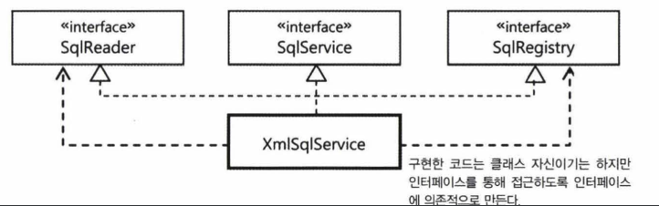

```
기능이 같은 여러 가지 기술이 존재한다는 이야기가 나오면 "서비스 추상화"가 떠올라야 한다.
로우레벨의 구체적인 기술과 API에 종속되지 않고 추상화된 레이어와 API를 제공해서 구현 기술에 대해 
독립적인 코드를 작성할 수 있게 해주는 "서비스 추상화"가 필요하다. 

DI의 가치를 제대로 누리기가 쉽진 않다.
DI에 필요한 유연하고 확장성이 뛰어난 오브젝트 설계를 하려면 많은 고민과 학습, 훈련, 경험이 필요하다.
추천하고 싶은 한 가지가 있다면 DI를 의식하면서 설계하는 방식이다.
런타임시에 의존 오브젝트를 다이내믹하게 연결해줘서 유연한 확장을 꾀하는게 목적이기 때문에
항상 확장을 염두해두고 오브젝트 사이의 관계를 생각해야 한다.

"인터페이스 분리 원칙"이 주는 장점은 모든 클라이언트가 자신의 관심에 따른 접근 방식을 불필요한 간섭 없이 유지할 수 있다는 점이다.

어노테이션 같은 메타 정보를 활용하는 프로그래밍 방식은 프로그래밍 언어나 API 사용법 외에 미리 정의된 규칙과 관례를 기억해야하고
메타정보를 보고 프로그램이 어떻게 동작할지 이해해야 하는 부담을 주기도 한다.
"정책을 기억 못 하거나 잘못 알고 있을 경우 의도한 대로 동작하지 않는 코드가 만들어질 수 있다."

스프링 3.1은 XML에서 자주 사용되는 전용 태그를 "@Enable"로 시작하는 어노테이션을 대체할 수 있게 다양한 어노테이션을 제공한다.
```

# **7.1 SQL과 DAO의 분리**

현재 SQL 변경이 필요한 상황이면 DAO 코드가 수정될 수 밖에 없다.  
**독립적인 SQL 서비스를 만들어보자.**  

## SQL 서비스 인터페이스 [예제](https://github.com/jdalma/tobyspringin5/commit/62998c423f7738ed8cc25c6a199291c432024423)

1. `SqlService` 인터페이스 추가
2. **SqlRetrievalFailureException** 커스텀 예외 추가
   - 조금 더 세세한 예외를 구분하고 싶다면 해당 예외의 서브클래스를 추가로 정의하자
3. `SqlService` 구현체 `SimpleSqlService` 추가

# **7.2 인터페이스의 분리와 자기참조 빈**

## JAXB 세팅 [예제](https://github.com/jdalma/tobyspringin5/commit/ff2fbd9d0dfd51e7624bc56fe8583946281381c7)

XML 파일에서 SQL을 읽어뒀다가 DAO에게 제공해주는 SQL 서비스 구현 클래스를 만들어보자  

**JAXB**  
XML에 담긴 정보를 파일에서 읽어오는 방법은 다양하다.  
`Java Architecture for XML Binding` JAXB를 이용하겠다.  
JDK 6 이상이라면 `java.xml.bind`패키지가 포함되어 있다.  
- XML 문서 정보를 트리 구조의 오브젝트로 직접 매핑해준다.
- XML 문서의 구조를 정의한 스키마를 이용해서 매핑할 오브젝트의 클래스까지 자동으로 만들어주는 컴파일러도 제공해준다.
- 스키마 컴파일러를 통해 자동 생성된 오브젝트에는 매핑정보가 어노테이션으로 담겨 있다.

**JAXB**에서는     
`XML`문서를 읽어서 자바의 오브젝트로 변환하는 것을 **언마샬링**이라고 부른다.    
반대로 바인딩 오브젝트를 `XML`문서로 변환하는 것을 **마샬링**이라고 한다.  

```xml
<?xml version="1.0" encoding="UTF-8"?>
<schema xmlns="http://www.w3.org/2001/XMLSchema"
        targetNamespace="http://www.epril.com/sqlmap"
        xmlns:tns="http://www.epril.com/sqlmap" elementFormDefault="qualified">

    <element name="sqlmap">
        <complexType>
            <sequence>
                <element name="sql" maxOccurs="unbounded" type="tns:sqlType" />
            </sequence>
        </complexType>
    </element>
    <complexType name="sqlType">
        <simpleContent>
            <extension base="string">
                <attribute name="key" use="required" type="string" />
            </extension>
        </simpleContent>
    </complexType>
</schema>
```

위의 `sqlmap.xsd`를 프로젝트 루트에 두고 `xjc -p main.java.springbook.chapter07.jaxb sqlmap.xsd -d src` 명령어를 실행하면 아래와 같이 실행된다
- jdk 11로는 되지 않아서 jdk 8로 변경하고 실행했다
  - jdk 11부터는 포함되지 않는다고 한다
  - `implementation("javax.xml.bind:jaxb-api:2.3.1")` gradle 의존성 추가

```
스키마의 구문을 분석하는 중...
스키마를 컴파일하는 중...
src/main/java/springbook/chapter07/jaxb/ObjectFactory.java
src/main/java/springbook/chapter07/jaxb/SqlType.java  // <sqlmap>과 <sql>에 대한 바인딩 클래스
src/main/java/springbook/chapter07/jaxb/Sqlmap.java   // <sqlmap>과 <sql>에 대한 바인딩 클래스
src/main/java/springbook/chapter07/jaxb/package-info.java
```

## JAXB 학습 테스트 [예제](https://github.com/jdalma/tobyspringin5/commit/5f5f75f62f427a784b4cd3c56b7896d1db324d32)

**스프링부트에서는 java 아래 소스 코드는 컴파일 되어서 .class 파일이 되고 그거랑 resources 아래 있는 파일이랑 합쳐서 클래스 패스로 잡히게 됩니다.**
- resources폴더 안에 작성하지 않고 다른 곳에 작성한다면 다 무시한다.
**부트에서 하셨으면 자바 폴더와 리소스 폴더가 구분이 되어서 들어가야 합니다. 소스 폴더에 넣은 일반 파일은 클래스패스로 잡히지 않아요.**   

## 1. XML파일을 이용하는 SQL서비스 적용 [예제](https://github.com/jdalma/tobyspringin5/commit/47966d6e21575c9c63bcf2af9449a409497fbca6)

한 XML파일은 한 번만 읽도록 하여, XML파일로 부터 읽은 내용은 어딘가에 저장해두고 DAO에서 요청이 올 때 사용해야 한다.  

## 2. `XmlSqlService` 빈의 초기화 작업 수정 [예제](https://github.com/jdalma/tobyspringin5/commit/f20dfcc0a27aaa7b1d393dfaca821e4525578efe)

현재 `XmlSqlService` 생성자에 아래와 같이 **예외가 발생할 수도 있는 복잡한 초기화 작업을 다루는 것은 좋지 않다.**  

1. 오브젝트를 생성하는 중에 생성자에서 발생하는 예외는 다루기 힘들다.
2. 상속하기 불편하다.
3. 읽어들일 파일의 이름이 하드코딩 되어 있다.

```java
public XmlSqlService() {
    String contextPath = Sqlmap.class.getPackage().getName();
    try {
        JAXBContext jaxbContext = JAXBContext.newInstance(contextPath);
        Unmarshaller unmarshaller = jaxbContext.createUnmarshaller();
        InputStream is = ClassLoader.class.getResourceAsStream("/sqlmap.xml");
        Sqlmap sqlmap = (Sqlmap) unmarshaller.unmarshal(is);

        for (SqlType sql : sqlmap.getSql()) {
            this.sqlMap.put(sql.getKey(), sql.getValue());
        }
    } catch (JAXBException e) {
        // JAXBException은 복구 불가능한 예외이기 때문에 RuntimeException으로 포장해서 던진다
        throw new RuntimeException(e);
    }
}
```

**초기 상태를 가진 오브젝트를 만들어놓고 별도의 초기화 메소드를 사용하는 방법이 바람직하다.**  
외부에서 DI로 설정해줄 수 있게 만들어보자

- `sqlmap.xml` SQL 파일 이름을 외부에서 지정하자
- 생성자로 XML파일을 읽지 말고 별도의 메소드로 분리하여 XML파일을 읽어들이자
   - `@Bean`으로 등록하면서 `loadSql()`을 직접 호출해주는 방법
   - `loadSql()`의 메소드 레벨에 빈 후처리기 `@PostConstruct`를 통해 호출하는 방법

1. `@Configuration`을 통해 `XmlSqlService`를 스프링 빈으로 등록
2. 빈으로 등록하면서 `sqlmap.xml`파일 이름 전달
3. `@PostConstruct` 빈 후처리기를 통해 빈으로 등록된 후 `sqlmap.xml`의 XML파일을 읽어 SQL 정보를 **언마샬링**
4. 전역 필드에 `SqlMap`을 갱신

## 3. 책임에 따른 인터페이스 정의 (`SqlRegistry`, `SqlReader`)

현재 `XmlSqlService`는 특정 포맷의 `XML`에서 SQL데이터를 가져오고, 이를 `Map`타입 컬렉션에 저장한다.    
**SQL을 가져오는 방법에 있어서는 특정 기술에 고정되어 있다.**  
가져온 SQL 정보를 `Map`타입 컬렉션이 아니라 다른 방식으로 저장해두고 이를 검색해서 가져오려면 직접 고치거나 새로 수정해야 한다.  
- **`XmlSqlService`가 변경되는 이유가 두 가지라면 이는 단일책임원칙을 위반하는 것이다**

분리 가능한 관심사를 구분해보자. `XmlSqlService`구현을 참고해서 독립적으로 변경 가능한 책임을 뽑아보자.
1. **SQL 정보를 외부의 리소스로부터 읽어오는 것**
2. **SQL을 보관하고 필요할 때 제공하는 것**
3. 부가적으로, **한 번 가져온 SQL을 필요에 따라 수정할 수 있게 하는것**


## 4. 자기참조 빈 : `XmlSqlService`에서 모든 인터페이스 구현 [예제](https://github.com/jdalma/tobyspringin5/commit/7e67d9428e033499289ab6c20407f628334d4c10)



**`XmlSqlService`클래스는 이 세 가지 관심과 책임을 가지고 있었는데 분리된 인터페이스를 다 구현하도록 먼저 만들어보자**  

```java
@Bean
public SqlService sqlService() {
    XmlSqlService sqlService = new XmlSqlService();
    sqlService.setSqlmapFile("sqlmap.xml");
    sqlService.setSqlReader(sqlService);
    sqlService.setSqlRegistry(sqlService);
    return sqlService;
}
```

**책임과 관심사가 복잡하게 얽혀 있어서 확장이 힘들고 변경에 취약한 구조의 클래스를 유연한 구조로 만들려고 할 떄 처음 시도해볼 수 있는 방법이다.**  
- 실제로 스프링에서 제공하는 클래스 중에도 `자신의 의존 오브젝트 인터페이스를 스스로 구현하고 자신을 DI하는 코드가 제법 있다`


## 5. 의존성 분리 : `HashMapSqlRegistry`, `JaxbXmlSqlReader` 클래스 추가 [예제](https://github.com/jdalma/tobyspringin5/commit/6fbe09225e3b25b448cafbae9346ed0a40ce0149)


## 6. 디폴트 의존관계를 갖는 `DefaultSqlService` 추가 [예제](https://github.com/jdalma/tobyspringin5/commit/d44db08363d5e9505fae1678fd87143e338fcdac)

이제 `BaseSqlService`는 `sqlReader`와 `sqlRegistry` 프로퍼티의 DI를 통해 의존관계를 자유롭게 변경해가면서 기능을 확장할 수 있다.  
하지만 3개의 빈을 등록해줘야 한다는 점이 귀찮게 느껴지기도 한다.  
**이렇게 확장을 고려해서 기능을 분리하고, 인터페이스와 전략 패턴을 도입하고, DI를 적용한다면 늘어난 클래스와 인터페이스 구현과 의존관계 설정에 대한 부담은 감수해야 한다.**  

**디폴트 의존관계란?**  
외부에서 DI받지 않는 경우 기본적으로 자동 적용되는 의존관계를 말한다.

# **7.3 서비스 추상화 적용**

`JaxbXmlSqlReader`는 좀 더 개선하고 발전시킬 부분이 있다.
1. 자바에는 `JAXB`외에도 다양한 XML과 자바 오브젝트를 매핑하는 기술이 있어 필요에 따라 다른 기술로 손쉽게 바꿀 수 있어야 한다.
2. XML 파일을 좀 더 다양한 소스에서 가져올 수 있게 만들어야 한다.
   - `임의의 클래스패스나 파일 시스템 상의 절대위치 또는 HTTP 프로토콜을 통해 원격에서 가져오도록 확장할 수는 없는가` 하는 점이다.

**Object-XML Mapping** 서비스 추상화

1. `Castor XML`
2. `JiBX`
3. `XmlBeans`
   - 아파치 XML 프로젝트의 하나
4. `Xstream`

기능이 같은 여러 가지 기술이 존재한다는 이야기가 나오면 **"서비스 추상화"** 가 떠올라야 한다.  
로우레벨의 구체적인 기술과 API에 종속되지 않고 추상화된 레이어와 API를 제공해서 구현 기술에 대해 독립적인 코드를 작성할 수 있게 해주는 "서비스 추상화"가 필요하다.

**스프링이 제공하는 OXM 추상 계층의 API를 이용해 XML 문서와 오브젝트 사이의 변환을 처리하게 하면, 코드 수정 없이도 OXM 기술을 자유롭게 바꿔서 적용할 수 있다.**  

## 7. Spring `Jaxb2Marshaller` 테스트 [예제](https://github.com/jdalma/tobyspringin5/commit/6121c6767e7e58f4f79f892e2eca2a3bf9569248)

스프링이 제공하는 OXM 추상화 서비스 인터페이스에  
자바 오브젝트 → XML `Marshaller`와  
XML → 자바 오브젝트 `Unmarshaller`가 있다

Spring `Jaxb2Marshaller`는 `Unmarshaller`인터페이스와 `Marshaller`인터페이스 둘 다 구현했다.  

## 8. OXM 서비스 추상화 적용 [예제](https://github.com/jdalma/tobyspringin5/commit/d5ca2a517b30ad07af4605e7c30f1ea04b272ed6)

이제 스프링의 OXM 추상화 기능을 이용하는 `SqlService`를 만들어보자.  
**이름은 `OxmSqlService`라고 하고 `SqlRegistry`는 DI 받을 수 있게 만들지만 `SqlReader`는 스프링의 OXM 언마샬러를 이용하도록 `OxmSqlService`내에 고정시켜야 한다.**  


여기서 `SqlReader`구현체는 `OxmSqlService`의 내부 클래스로 선언한다.  
현재 `OxmSqlService`와 `BaseSqlService` 이 두 클래스에서 중복되는 메소드가 있다.  
- `loadSql()`
- `getSql()`

수정이 일어난다면 두 곳 다 수정해줘야한다.  
중복이 된 두 메소드 실행을 `BaseSqlService`에게 위임하도록 수정했다  

## 9. 리소스(SQL 매핑 정보 파일) 추상화 `Resource`, `ResourceLoader` 적용 [예제](https://github.com/jdalma/tobyspringin5/commit/212487bd27386b1e3978deaa30535df6bf7bc3f9)

XML 파일을 좀 더 다양한 소스에서 가져올 수 있게 만들어야 한다.
- `임의의 클래스패스나 파일 시스템 상의 절대위치 또는 HTTP 프로토콜을 통해 원격에서 가져오도록 확장할 수는 없는가` 하는 점이다.

기존에는 클래스패스로 부터 `resources`안에 있는 파일을 읽기 위해 **ClassLoader 클래스의 `getResourceAsStream()`을 사용했다.**  
이를 **파일 시스템이나 웹상의 HTTP를 통해 접근 가능한 파일로 바꾸려면 URL클래스를 사용하도록 코드를 변경해야 한다.**  
또한 **서블릿 컨텍스트 내의 리소스를 가져오려면 `ServletContext`의 `getResourceAsStream()`을 사용해야 한다.**  

**리소스의 위치와 종류에 따라서 다른 클래스와 메소드를 사용해야 한다는 점이 불편하다.**  
스프링은 **자바에 존재하는 일관성 없는 리소스 접근 API를 추상화해서 `Resource`라는 추상화 인터페이스를 제공한다.**  
- 스프링의 거의 모든 API는 외부의 리소스 정보가 필요할 때는 항상 이 `Resource` 추상화를 이용한다
- **`Resource`는 빈이 아니라 단순한 정보를 가진 값으로 취급된다**

그래서 스프링에는 URL클래스와 유사하게 접두어를 이용해 `Resource`오브젝트를 선언하는 `ResourceLoader`를 제공한다.  
- [`Spring Docs` ResourceLoader](https://docs.spring.io/spring-framework/docs/current/javadoc-api/org/springframework/core/io/ResourceLoader.html)

`ResourceLoader`의 대표적인 예는 **애플리케이션 컨텍스트**다.  
- 따라서 모든 애플리케이션 컨텍스트는 리소스 로더이기도 하다.

**스프링에서 파일을 읽거나 참조하는 기능을 만들때는 `Resource`타입의 추상화된 기능을 사용하자**

# **7.4 인터페이스 상속을 통한 안전한 기능확장**

SQL을 수정하거나 추가하기 위해 기능을 추가해야 한다면 기존 `SqlRegistry`인터페이스는 건드리지 마라.  

```java
public interface UpdatableSqlRegistry extends SqlRegistry {
    void updateSql(String key, String sql) throws SqlUpdateFailureException;

    void updateSql(Map<String, String> sqlmap) throws SqlUpdateFailureException; 
}
```

**`SqlRegistry`의 서브 인터페이스로 기능을 추가할 수 있다.** 


실제 오브젝트 사이에서 일어나는 DI의 결과만 보자면 `BaseSqlService`와 `SqlAdminService` 오브젝트는 **동일한 `MyUpdatableSqlRegistry` 오브젝트를 DI 받아서 사용한다.**  
동일한 오브젝트에 의존하고 있지만 **각자의 관심과 필요에 따라서 다른 인터페이스를 통해 접근한다.**  

# **7.5 DI를 이용해 다양한 구현 방법 적용하기**

현재 SQL 정보를 읽어들여서 메모리에 두고 그대로 사용하기 때문에 **SQL이 수정된다면 서버를 재시작해야 한다.**  
운영 중인 시스템에서 사용하는 정보를 실시간으로 변경하는 작업을 만들 때 가장 먼저 고려해야 할 사항은 `동시성 문제`다.  

**자바에서 제공되는 주요 기술을 이용해 간단한 방식으로 어느 정도 안전한 업데이트가 가능한 SQL 레지스트리를 구현해보자**  

## `ConcurrentHashMap`을 이용한 수정 가능 SQL 레지스트리 [예제](https://github.com/jdalma/tobyspringin5/commit/e8302ddb5bcd361929321f8afaf1658adb384ebd)

## 내장형 데이터베이스를 이용한 SQL 레지스트리 [예제](https://github.com/jdalma/tobyspringin5/commit/c3f15df738b72561d04ae958849a252397ff3091)

내장형 메모리 DB는 애플리케이션과 생명주기가 같다.  
- `Derby`,`HSQL`,`H2`

애플리케이션 내에서 DB를 가동시키고 초기화 SQL 스크립트를 실행시키는 등의 초기화 작업이 별도로 필요하다.  
대신 스프링은 **내장형 DB를 초기화하는 작업을 지원하는 편리한 내장형 DB 빌더를 제공한다.**  

기존 `ConcurrentHashMap`으로 구현한 클래스와 `내장형 DB`로 구현핰 클래스들의 테스트 클래스 `AbstractUpdatableSqlRegistryTest`추가한다.  
추상 클래스의 `createUpdatableSqlRegistry()`를 통해 구현체를 다르게 하여 테스트를 한다.

## 내장형 DB 빌더 학습 테스트 [예제](https://github.com/jdalma/tobyspringin5/commit/d8e4fbd58ee57438fd4edeabdf604fd03e41f6c8)

내장형 DB 빌더는 **DB 엔진을 생성**하고 **초기화 스크립트를 실행**해서 테이블과 초기 데이터를 준비한뒤에 DB에 접근할 수 있는 **`Connection`을 생성해주는 `DataSource`오브젝트를 돌려주게 된다.**  
- 정확히는 DB 셧다운 기능을 가진 `EmbeddedDatabase`타입 오브젝트다

`DataSource`인터페이스를 상속한 `EmbeddedDatabase`타입이기 때문에 일반적인 사용 방법을 그대로 적용할 수 있다.

## SQL 업데이트 트랜잭션 적용 [예제](https://github.com/jdalma/tobyspringin5/commit/46538f88d2833944398b463d535349c59b7829e0)

# **7.6 스프링 3.1의 DI** 

스프링은 2.5 버전에서 DI와 웹 기능 일부에 어노테이션을 적용하기 시작했고, 스프링 3.0에서는 다양한 영역으로 어노테이션의 활용 범위를 넓혔다.  
**스프링 3.1에서는 어노테이션을 이용한 메타정보 작성 방식이 거의 모든 영역으로 확대돼서, 원한다면 스프링 애플리케이션을 XML없이도 작성할 수 있게 됐다.**  

## 빈 스캐닝과 Config 정보 수정 [예제](https://github.com/jdalma/tobyspringin5/commit/45cb6e8758123e8c71230ddcd74bfe745256612d)

1. `@ContextConfiguration` 제거, `@SpringJunitConfig`로 수정
2. **DI Config** 일부 제거 후 `@Autowired` 적용

### `@ContextConfiguration`

스프링 테스트가 테스트용 DI 정보를 어디서 가져와야 하는지 지정할 때 사용하는 어노테이션이다.  

### `@ImportResource`

자바 클래스로 만들어진 DI 설정 정보에서 XML의 설정 정보를 지정하는 어노테이션이다. 

## 목적에 맞는 컨텍스트 설정 분리 [예제](https://github.com/jdalma/tobyspringin5/commit/dd86bad2b53f785dcb0c85e5234a6ec5134db186)

지금은 **TestDBConfig**에 애플리케이션에 필요한 DI와 테스트에 필요한 DI 정보가 같이 작성되어 있다.  

1. `테스트용 DI`**TestAppContext**와 `실제 필요한 DI`**AppContext** 정보를 분리
2. `싪제 필요한 DI` 정보 중 `SQL 서비스용 빈`**SqlServiceContext** 분리

## 프로파일 ⭐️

`MailSender`빈이 실제 운영환경과 테스트 환경에서 중복된다.  
**ProductionAppContext**로 분리하자  

### `@Profile`과 `@ActiveProfiles` [예제](https://github.com/jdalma/tobyspringin5/commit/1dcadf9531a9b8990e63857e9fd9a4f6ea074a87)

- 운영 환경 : **AppContext** + **ProductionAppContext** 
- 테스트 환경 : **AppContext** + **TestAppContext**

스프링 3.1은 프로파일이 지정되어 있지 않은 빈 설정은 default 프로파일로 취급한다.  
**프로파일을 적용하면 모든 설정 클래스를 부담없이 메인 설정 클래스에서 `@Import`해도 된다는 장점이 있다.**  

`@Profile`이 붙은 설정 클래스는 `@Import`로 가져오든 `@ContextConfiguration`에 직접 명시하든 상관없이 **현재 컨테이너의 활성 프로파일 목록**에 자신의 프로파일 이름이 들어있지 않으면 무시된다.  
- **활성 프로파일** : 스프링 컨테이너를 실행할 때 추가로 지정해주는 속성

### `@Profile`의 빈 설정만 잘 적용되었을까?

```java
@SpringJUnitConfig(classes = AppContext.class)
@ActiveProfiles("test")
class UserServiceTest {

    @Autowired
    private DefaultListableBeanFactory bf;

    @Test
    void beans() {
        for (String bean : bf.getBeanDefinitionNames()) {
            System.out.printf("%s : %s%n", bean, bf.getBean(bean));
        }
    }

//    mailSenderImpl : springbook.chapter06.DummyMailSender@7516e4e5
}
```

- `DummyMailSender`가 빈으로 등록된 것을 볼 수 있다.

### 스태틱 중첩 클래스를 이용한 프로파일 적용 [예제](https://github.com/jdalma/tobyspringin5/commit/61a8b3a070fd899690fac4da5cc89ae7f7b6c910)

TestAppContext와 ProductionAppContext를 **AppContext**에 스태틱 중첩 클래스로 옮겼다.  
**AppContext**의 `@Import`도 줄어들고 설정 정보를 쉽게 한눈에 확인할 수 있다.


## 프로퍼티 소스 `@PropertySource` [예제](https://github.com/jdalma/tobyspringin5/commit/180c0e4b40e64a4851058ae7797239e996610daa)

DB 연결 정보를 환경에 따라 다르게 설정될 수 있어야 하고 손쉽게 변경할 수 있어야 한다.  
컨테이너가 프로퍼티 값을 가져오는 대상을 **프로퍼티 소스**라고 한다.  
스프링 3.1은 빈 설정 작업에 필요한 프로퍼티 정보를 컨테이너가 관리하고 제공해준다.
- 환경 변수나 시스템 프로퍼티처럼 `디폴트로 프로퍼티 정보를 끌어오는 프로퍼티 소스`도 있고,
- `프로퍼티 파일이나 리소스의 위치를 지정해서 사용되는 프로퍼티 소스`도 있다.

`@PropertySource`로 등록한 리소스로부터 가져오는 프로퍼티 값은 **컨테이너가 관리하는 `Environment`타입의 환경 오브젝트에 저장된다.**  
**환경 오브젝트는 빈 처럼 필드로 주입받을 수 있다.**  

## 프로퍼티 정보 `@Value` [예제](https://github.com/jdalma/tobyspringin5/commit/f50dd3fc4367cf58a65382f5606c41c1ad8f7d90)

`Environment`오브젝트 대신 프로퍼티 값을 직접 DI 받는 방법도 가능하다.
- 프로퍼티 소스로 부터 값을 주입받을 수 있게 치환자를 이용한다
- 스프링이 타입 변환이 필요한 프로퍼티를 알아서 처리해준다는 장점

`@Value`와 **치환자**를 이용해 프로퍼티 값을 필드에 주입하려면 `PropertySourcePlaceHolderConfigurer`를 빈으로 등록해줘야 한다.  
빈 팩토리 후처리기로 사용되는 빈을 정의하는 것이다. 이 빈 설정 메소드는 반드시 **스태틱 메소드**로 선언해야 한다.  

## 빈 설정의 재사용과 `@Enable*` [예제](https://github.com/jdalma/tobyspringin5/commit/e349a19199e404cc2a3ecdc51b29a32925a9fc89)

현재 `SqlServiceContext`는 다른 빈 설정 정보와 성격이 다르기 때문에 분리시켜 놓았다.  
**SQL 서비스 빈은 서비스 인터페이스, 즉 API인 `SqlService`만 DAO에 노출하면 되고 나머지 구현 기술이나 방법은 내부에 감춰두고 필요에 따라 자유롭게 변경할 수 있어야 한다.**  

**sqlmap 파일 정보의 위치나 파일 이름을 외부에서 주입할 수 있게 먼저 수정하자**  

스프링 3.1은 `SqlServiceContext`처럼 모듈화된 빈 설정을 가져올 때 사용하는 `@Import`를 다른 어노테이션으로 대체할 수 있는 방법을 제공한다.  
`@Import(value = SqlServiceContext.class)` 이 메타 어노테이션을 가진 `@EnableSqlService`를 추가해서 **AppContext**에 적용하자.
